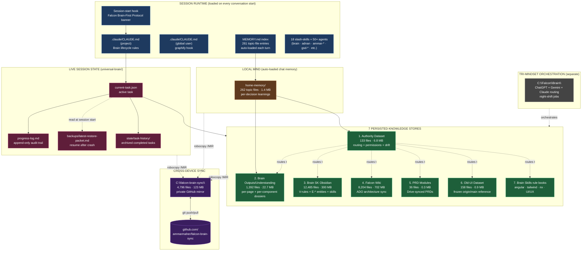
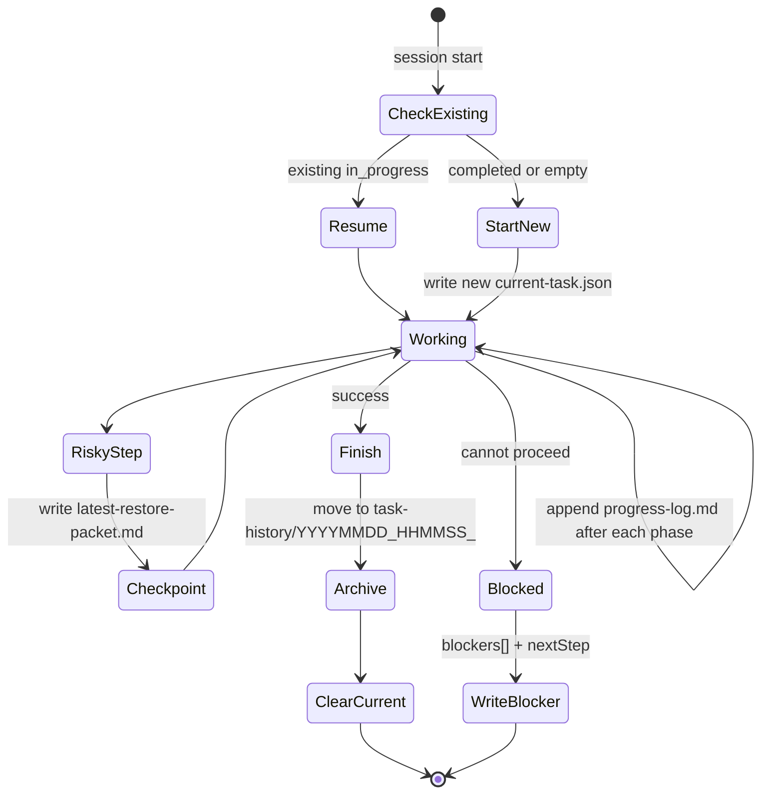
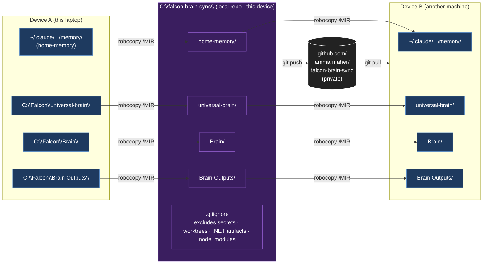
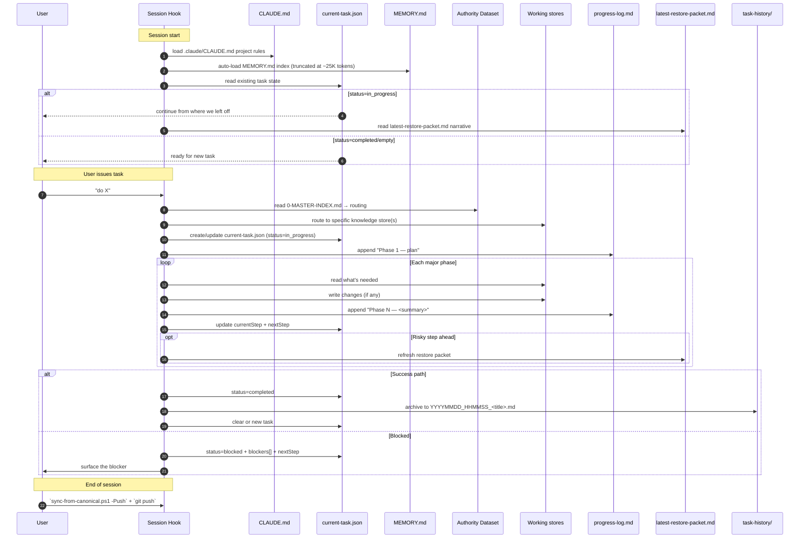
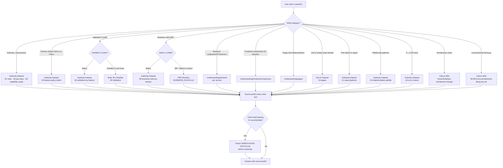
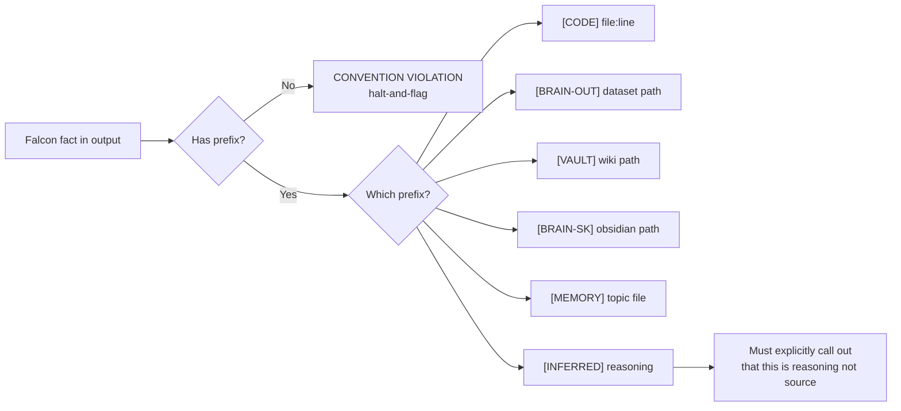

# Falcon Brain — Architecture Chart

> [!tldr]
> **What this is.** A complete map of every brain folder, every anchor MD file, every data flow, every lifecycle phase, every sync edge. Read this once and you will understand the entire knowledge ecosystem end-to-end.
>
> **What this is NOT.** This file is a chart, not a router. For "where does answer X live", use `0-MASTER-INDEX.md`. For "is claim Y verified", use `VERIFICATION-STATUS.md`. This file shows the *shape* of the brain — those two files use the shape to answer questions.

## Table of contents

1. [Big-picture system diagram](#1--big-picture-system-diagram)
2. [The 10 stores at a glance](#2--the-10-stores-at-a-glance)
3. [Per-store deep map](#3--per-store-deep-map)
4. [Session-state layer (universal-brain)](#4--session-state-layer-universal-brain)
5. [Cross-device sync architecture](#5--cross-device-sync-architecture)
6. [Lifecycle flow — session start to task finish](#6--lifecycle-flow--session-start-to-task-finish)
7. [Read / Write matrix per phase](#7--read--write-matrix-per-phase)
8. [Routing decision tree](#8--routing-decision-tree-compressed-from-master-index)
9. [Source-prefix protocol](#9--source-prefix-protocol)
10. [Verification ladder](#10--verification-ladder)
11. [Hygiene rules (invariants)](#11--hygiene-rules-invariants)
12. [Quick reference card](#12--quick-reference-card)

---

## 1 — Big-picture system diagram



**Reading the diagram:**
- **Blue (SESSION)** loads automatically every conversation start. You don't trigger it.
- **Pink (STATE)** is what survives compaction — file-backed, source-of-truth per `.claude/CLAUDE.md:77`.
- **Green (KNOWLEDGE)** is the persisted facts. The Authority Dataset is the entry point — its Master Index routes you into the right green box.
- **Orange (LOCAL MIND)** is per-decision learnings (one file per "thing I learned"). The MEMORY.md index lists all 262.
- **Purple (SYNC)** is how the brain travels across machines.
- **Gray (TRI-MINDSET)** is a separate concept — the Falcon Brain that orchestrates ChatGPT/Gemini/Claude for night-shift jobs. Not the same thing as the session-state brain.

---

## 2 — The 10 stores at a glance

| # | Store | Path | Files | Size | Prefix | Refresh | Verification |
|---|---|---|---:|---:|---|---|---|
| 1 | Authority Dataset | `C:\Falcon\Brain Outputs\datasets\authority-dataset\` | 133 | 6.8 MB | `[BRAIN-OUT]` | Manual + scanner | 🟢🟡✋ Mixed |
| 2 | Understanding | `C:\Falcon\Brain Outputs\understanding\` | 1,392 | 22.7 MB | `[BRAIN-OUT]` | Brain SK skills | 🟡 Structural |
| 3 | Brain SK Obsidian | `C:\Falcon\Brain SK\_obsidian\` (+ `skills\`, `domains\`, `protocols\`) | 12,485 | 300 MB | `[BRAIN-SK]` | Brain SK skills | 🟡 Structural |
| 4 | Falcon Wiki | `C:\Falcon\falcon-wiki\` | 8,204 | 702 MB | `[VAULT]` | ADO weekly | 🟡 Source-prefix enforced |
| 5 | PRD Modules | `C:\Falcon\Brain Outputs\prd\modules\` | 36 | 0.3 MB | `[BRAIN-OUT]` | Drive sync (manual) | 🟢 (Tab 2 blocked) |
| 6 | Old-UI Dataset | `C:\Falcon\Brain Outputs\datasets\old-ui-dataset\` | 158 | 0.9 MB | `[BRAIN-OUT]` | Frozen 2026-05-16 | 🟢 Code-grounded |
| 7 | Brain Skills | `C:\Falcon\brain-skills\` + `C:\Falcon\Brain SK\skills\` | many | — | `[BRAIN-SK]` | Hand-maintained | 🟡 Authoritative for its rule |
| 8 | Home memory | `C:\Users\User\.claude\projects\C--Falcon\memory\` | 262 | 1.4 MB | `[MEMORY]` | Auto-loaded each session | 🟡 Point-in-time |
| 9 | Universal-brain (live state) | `C:\Falcon\universal-brain\` | 14 | <1 MB | (state) | Per-task | 🟢 Live |
| 10 | Sync repo | `C:\falcon-brain-sync\` ↔ private GH | 4,796 | 123 MB | (mirror) | `sync-from-canonical.ps1` | n/a |

---

## 3 — Per-store deep map

### 3.1 — Authority Dataset

**Path:** `C:\Falcon\Brain Outputs\datasets\authority-dataset\`
**Prefix:** `[BRAIN-OUT]`
**Purpose:** Single source of truth for who-can-do-what + validation + drift + business rules + porting + errors + pitfalls + trigger phrases. The routing entry point for the entire brain.

```
authority-dataset/
├── 0-MASTER-INDEX.md          ◄── ENTRY POINT — read FIRST every session
├── 00-INDEX.md                ◄── self-index of the dataset
├── 00-VERIFICATION-GATE.md    ◄── 19 falsifiable cold-answer questions
├── KNOWLEDGE-DUMP.md          ◄── flat regen for PDF
├── VERIFICATION-STATUS.md     ◄── honest accounting per claim
├── 01-roles/                  ── 6 roles · sys-admin · sys-ops · sys-products · acc-owner · acc-admin · acc-user
├── 02-statuses/               ── 9 status enums (account · contract · service · user)
├── 03-pes-keys/               ── 47-key registry + raw map + mgmt gaps
├── 04-feature-parity-matrix/  ── Falcon-only vs Client-only vs Shared
│   ├── MATRIX.md
│   └── <feature>.compare.md   ── per-feature admin vs mgmt diff
├── 05-capability-maps/        ── per-role 60-row capability table
├── 06-validation-by-feature/  ── V-rule × feature matrix (3-layer architecture)
├── 07-cross-cutting/          ── gateway-routing · session-shape · test-users · perm-sheet-gaps
├── 08-entity-drift-by-feature/── E-* × feature matrix
├── 09-business-rules-by-feature/── BR-* × feature matrix (180 rules)
├── 10-non-pes-gates-by-feature/── what hides UI besides PES
├── 11-copy-playbook/          ── 12-step admin → mgmt port recipe
│   ├── copy-admin-feature-to-mgmt.md
│   ├── namespace-flip.checklist.md
│   ├── gateway-flip.checklist.md
│   ├── session-binding.checklist.md
│   ├── dto-divergence.catalog.md
│   └── endpoint-suffix.catalog.md
├── 12-auto-sync/              ── scanner integration
├── 13-error-catalog/          ── ~130 error codes + FE contract
├── 14-flow-playbook-integration/── per-flow integration spec
│   ├── Add-Client.integration.md
│   ├── Add-User.integration.md
│   └── Add-Node-and-Edit-Node.integration.md
├── 15-implementation-pitfalls/── PITFALLS.md + ANTI-PATTERNS.md
├── 16-trigger-phrases/        ── ~45 trigger phrases × 9 categories
├── 18-a-to-z-traces/          ── canonical A→Z trace per flow
├── 19-night-shift-readiness/  ── DECISION-PROTOCOL · NIGHT-SHIFT-LOOP · SPEC-PROTOCOL
├── 20-brain-maintenance/      ── MEMORY-GROW-PROTOCOL
├── 21-onboarding/             ── PR-TEMPLATE · READINESS-CHECKLIST
├── _runtime-verification/     ── runtime proof bundles (PES 21/21 lives here)
├── _pending-questions/        ── open Q-* tickets blocking dataset claims
├── _investigations/           ── timestamped investigation packets
└── _pdf-build/                ── PDF regeneration outputs
```

**Anchor files (read these first):**
- `0-MASTER-INDEX.md` — routes every question to its owning store
- `VERIFICATION-STATUS.md` — what's runtime-tested vs not
- `KNOWLEDGE-DUMP.md` — flat dump for PDF / for offline review

---

### 3.2 — Brain Outputs · Understanding

**Path:** `C:\Falcon\Brain Outputs\understanding\`
**Prefix:** `[BRAIN-OUT]`
**Purpose:** Deep per-page + per-component + per-service dossiers. The "what is feature X built of" store.

```
understanding/
├── backend/                   ── 18 service dossiers
│   ├── access/                ── endpoints · DTOs · validators · errors
│   ├── charging/
│   ├── commerce/
│   ├── contact-group/
│   ├── core-gateway/
│   ├── identity/
│   ├── provisioning/
│   ├── system-gateway/
│   ├── templates/
│   └── falcon-core-*-svc/    ── code-mirror per-service (duplicated for scanner)
├── frontend/
│   ├── architecture/          ── module federation + host-shell wiring
│   ├── components/            ── 62 component dossiers
│   ├── decisions/             ── architectural ADRs
│   ├── migration/             ── migration journals
│   ├── overlay-architecture/  ── loader · modal · popup specs
│   ├── patterns/              ── recurring FE patterns
│   ├── theme/                 ── tokens + Tailwind config
│   ├── continuous/            ── rolling scan outputs
│   └── _scan-state/           ── scanner metadata
├── glossary/                  ── domain term definitions
├── integration/               ── cross-service flow specs
├── journeys/                  ── user journeys end-to-end
├── pages/                     ── per-page dossiers (add-contract · edit-user · etc.)
├── rules/                     ── codified rules
├── wiki/                      ── ADO-mirror staging
└── _pending-questions/        ── open Qs blocking understanding claims
```

**Per-component dossier shape** (62 components × identical shape):
- `API.md` — props, variants, events
- `USAGE.md` — where the component is used
- (and others per the component capability skill)

**Per-page dossier shape:**
- `00-OVERVIEW.md` through `10-KAFKA_SIDE_EFFECTS.md`
- Step folders for multi-step wizards

---

### 3.3 — Brain SK Obsidian

**Path:** `C:\Falcon\Brain SK\`
**Prefix:** `[BRAIN-SK]`
**Purpose:** Obsidian knowledge graph with typed V-rule + E-* entity + permission notes. Also hosts the SK skills (rule books).

```
Brain SK/
├── _obsidian/                 ◄── the Obsidian vault
│   ├── 00-Home/               ── vault entry
│   ├── 05-Glossary/           ── domain terms
│   ├── 10-Pages/              ── per-page notes
│   ├── 12-Permissions/        ── permission matrices
│   ├── 15-PRD/                ── PRD-as-notes
│   ├── 16-Journeys/           ── user journeys
│   ├── 30-Validation/         ── 25 V-rule files (V-account-name-format · etc.)
│   ├── 35-Architecture/       ── architecture notes
│   ├── 36-Theming/            ── theme rules
│   ├── 37-Loading/            ── loader patterns
│   ├── 40-API/                ── 15 E-* entity reconciliations
│   ├── 40-Authority/          ── authority projections
│   ├── 45-Backend/            ── backend specs
│   ├── 47-Events/             ── Kafka events
│   ├── 60-Components/         ── component notes
│   ├── 61-Input-Index/        ── input-type catalog
│   ├── 65-Validation-Rules/   ── validation rule catalog
│   ├── 66-PES-Rules/          ── PES rule catalog
│   ├── 67-Business-Rules/     ── BR-* catalog
│   ├── 68-UI-UX-Rules/        ── UI/UX rule catalog
│   ├── 70-Gaps/               ── gap registry
│   ├── 80-Evidence/           ── evidence bundles
│   ├── 90-Approved-Patterns/  ── promoted patterns
│   └── _templates/            ── note templates
├── skills/                    ── 30+ SK skills
│   ├── ammar-brain-capability-audit/
│   ├── backend-api-understanding/
│   ├── bootstrap-health-check/
│   ├── business-understanding/
│   ├── component-capability-upgrade/
│   ├── frontend-master-router/
│   ├── get-shit-done/         ◄── 8-senior review board
│   ├── html-to-angular/
│   ├── initial-bootstrap-discovery/
│   └── ... 20+ more
├── protocols/                 ── orchestration protocols
├── reference/                 ── reference data
├── registries/                ── code registries
├── scripts/                   ── automation scripts
├── shared/                    ── shared assets
├── tools/                     ── tooling (falcon-eyes etc.)
├── templates/                 ── file skeletons
├── outputs/                   ── skill outputs
├── _night-shift/              ── night-shift artifacts
└── _scan-state/               ── scanner metadata
```

---

### 3.4 — Falcon Wiki (ADO sync)

**Path:** `C:\Falcon\falcon-wiki\`
**Prefix:** `[VAULT]`
**Purpose:** Mirror of the Azure DevOps wiki with PRDs-as-notes + architecture + endpoint registry + scorecards.

```
falcon-wiki/
├── Home/                      ── Software-Architecture-Design landing
├── 00-MOCs/                   ── Maps of Content (auto-discovery)
│   ├── Local-Backend-Bring-Up.md
│   ├── Local-Auth-Recipe.md
│   └── Authorization-Security-MOC.md
├── 10-PRD/                    ── PRDs as Obsidian notes
├── 100-Authority/             ── authority projections (mirror of authority-dataset)
├── 20-Pages/                  ── page-level wiki
├── 30-Components/             ── component-level wiki
├── 35-Libraries/              ── library catalogs
├── 40-Tokens/                 ── design tokens
├── 50-Services/               ── service-level wiki
├── 61-Input-Index/            ── input catalog (duplicate of Brain SK section)
├── 65-Validation-Rules/       ── V-rule catalog
├── 66-PES-Rules/              ── PES rule catalog
├── 67-Business-Rules/         ── BR-* catalog
├── 68-UI-UX-Rules/            ── UI/UX rule catalog
├── 69-Scorecards/             ── scoring artifacts
├── 70-Gaps/                   ── gap registry
├── 80-Questions/              ── open Q-* tickets
├── scripts/                   ── wiki sync + scan tooling
│   └── scan-authority.ps1     ◄── watches 67 source files for drift
├── _macros/                   ── Obsidian macros
├── _mounts/                   ── external mount points
└── _templates/                ── note templates
```

---

### 3.5 — PRD Modules

**Path:** `C:\Falcon\Brain Outputs\prd\modules\`
**Prefix:** `[BRAIN-OUT]`
**Purpose:** Drive-synced canonical PRDs. The business-truth store.

```
prd/modules/
├── 01-account-management/
│   ├── latest-prd.md          ◄── source-of-truth PRD
│   ├── BUSINESS_RULES.md      ── BR-AM-* (42 rules)
│   ├── ENTITIES.md            ── data model
│   ├── WORKFLOWS.md           ── user workflows
│   └── QUESTIONS.md           ── open Q-AM-* tickets
├── 02-user-management/        ── same shape · BR-UM-* (50 rules) · Tab 2 BLOCKED (Q-UM-07)
├── 03-contract-packaging-charging-billing-management/  ── BR-CC-* (50 rules)
├── 04-contact-group-management/  ── BR-CGM-* (38 rules)
├── 05-templates/              ── templating module
└── root-documents/            ── cross-module PRDs
```

---

### 3.6 — Old-UI Dataset

**Path:** `C:\Falcon\Brain Outputs\datasets\old-ui-dataset\`
**Prefix:** `[BRAIN-OUT]`
**Purpose:** Frozen snapshot of `origin/main` of `falcon-web-platform-ui` — the "what was shipped and works" reference.

```
old-ui-dataset/
├── 10-pages/                  ── per-page 9-file dossier extracts
│   ├── admin-console/<feature>/  (00-08 numbered files)
│   └── management-console/<feature>/
└── 99-registries/             ── catalog indexes
```

---

### 3.7 — Brain Skills

**Paths:** `C:\Falcon\brain-skills\` (root) + `C:\Falcon\Brain SK\skills\` (bulk)
**Prefix:** `[BRAIN-SK]`
**Purpose:** Hand-maintained rule books — angular · tailwind · nx · UI/UX · business · PRD · PDF · test authoring.

```
brain-skills/                  (small root catalog)
└── code-skills/               ── code-focused rule books

Brain SK/skills/               (the bulk — 30+ skills)
├── ammar-brain-capability-audit/
├── backend-api-understanding/
├── bootstrap-health-check/
├── brand/
├── business-understanding/
├── component-capability-upgrade/
├── executive-insight-reports/
├── frontend-master-router/
├── get-shit-done/             ◄── 8-senior review board (Architect+FE+BE+FS + 4 business)
├── html-to-angular/
├── imported-business/
├── initial-bootstrap-discovery/
└── ... ~20 more
```

Each skill = `Skill.md` (the entry) + supporting references / templates / tools.

---

### 3.8 — Home memory (auto-loaded MEMORY.md index)

**Path:** `C:\Users\User\.claude\projects\C--Falcon\memory\`
**Prefix:** `[MEMORY]`
**Purpose:** Per-decision learning files. Auto-loaded as MEMORY.md index at every session start.

```
~/.claude/projects/C--Falcon/memory/
├── MEMORY.md                  ◄── auto-loaded index (261 lines · ~116 KB)
└── *.md                       ── 261 topic files (one per decision/learning)
    ├── project_brain_sync_repo_2026_05_21.md
    ├── project_docker_health_login_verify_2026_05_21.md
    ├── infra_ado_ipv6_blocked_use_ipv4.md
    ├── project_validation_input_caps_wave_g_2026_05_24.md
    ├── feedback_falcon_ui_core_layout_traps.md
    └── ... 256 more
```

**Filename convention:** `<category>_<topic>_<YYYY_MM_DD>.md` where category ∈ `project | infra | feedback | rule`.

**Critical caveat:** MEMORY.md autoload truncates at ~25 K tokens (about 24 lines of the 261-line index). The rest only loads if I Grep / Read explicitly.

---

### 3.9 — Universal-brain (live session state)

**Path:** `C:\Falcon\universal-brain\`
**Purpose:** The brain skill's runtime files — what survives compaction.

See [Section 4](#4--session-state-layer-universal-brain) for full detail.

---

### 3.10 — Sync repo

**Path:** `C:\falcon-brain-sync\` ↔ `https://github.com/ammarmaher/falcon-brain-sync` (private)
**Purpose:** Cross-device portability via `robocopy /MIR` + git.

See [Section 5](#5--cross-device-sync-architecture) for full detail.

---

## 4 — Session-state layer (universal-brain)

The 14 files in `C:\Falcon\universal-brain\` are the only brain bits that change *during* a task. Everything else is read-only knowledge.

```
universal-brain/
├── state/
│   ├── current-task.json                ◄── ACTIVE TASK · single source of truth
│   ├── progress-log.md                  ◄── append-only audit trail (phase-by-phase)
│   ├── session-coordination-2026-05-21.md  ── per-day coordination notes
│   └── task-history/                    ◄── archived completed tasks
│       ├── 20260515_0510_org-hierarchy-falcon-eyes-blocked.md
│       ├── 20260515_1120_org-hierarchy-p3-polish-completed.md
│       ├── 20260518_PES_grant_infra_bugfix.md
│       ├── 20260520_150800_ib-dialog-visual-parity-wave17.md
│       ├── 20260520_190500_data-table-skeleton-loading-system.md
│       └── 20260521_145000_service-pricing-shadow-row-delete.md
└── backups/
    └── latest-restore-packet.md         ◄── resume-after-crash narrative
```

### 4.1 — `current-task.json` shape

Required fields per the brain skill template (`templates/task-state-template.json`):

| Field | Purpose |
|---|---|
| `taskId` | kebab-case ID with date suffix (e.g. `brain-setup-trust-assessment-2026-05-27`) |
| `title` | one-line human-readable |
| `status` | `in_progress` · `completed` · `blocked` |
| `startedAt` / `completedAt` | ISO timestamps |
| `owner` | typically `claude` |
| `files_changed` | array of absolute paths |
| `context` | why this task exists |
| `root_cause` | if a bug-fix task |
| `fix` | what changed |
| `build_evidence` | per-target compile result + hash |
| `runtime_verified` | boolean — was this seen working in a browser/curl |
| `commits_made` | boolean — did we actually git commit |
| `nextStep` | what the next session should do |
| `blockers` | array (if status = blocked) |

### 4.2 — Lifecycle of a task in this layer



### 4.3 — Slash commands that drive this layer

Per `C:\Falcon\.claude\commands\`:

| Command | Effect |
|---|---|
| `/start-brain` | Initialize the brain at session start |
| `/new-task` | Create a fresh `current-task.json` |
| `/check-session-health` | Read `session-health.json` thresholds |
| `/save-session-state` | Refresh checkpoint + restore packet |
| `/restore-session-state` | Load latest restore packet and resume |
| `/finish-task` | Archive to `task-history/` + clear current |

---

## 5 — Cross-device sync architecture



**Daily rhythm:**
- **End-of-session:** `.\sync-from-canonical.ps1 -Push` → `git push`
- **Start-of-session:** `git pull` → `.\sync-from-canonical.ps1 -Pull`
- **Dry-run check:** `.\sync-from-canonical.ps1 -DryRun`

**New-device onboarding:**
1. Install Git + Claude Code
2. `git clone <sync-repo-url> C:\falcon-brain-sync`
3. `.\sync-from-canonical.ps1 -Pull`
4. Open Claude Code with `C:\Falcon` as working dir
5. The session-start hook fires; brain comes alive

**Conflict policy:** robocopy mirrors — last-write-wins. For divergent `.md` files, rely on `git merge`. Brain stays in the dedicated sync repo; **NEVER** `git init` inside `C:\Falcon` (tangles with product repos).

**Hardcoded path caveat:** `sync-from-canonical.ps1` `$Pairs[0]` hardcodes `C:\Users\User\…`. On a device with a different home path, edit this entry first.

---

## 6 — Lifecycle flow — session start to task finish



---

## 7 — Read / Write matrix per phase

| Phase | READS from | WRITES to |
|---|---|---|
| **Session start (hook)** | session-start hook · `.claude/CLAUDE.md` · `MEMORY.md` (index) · `current-task.json` | nothing yet |
| **Resume (if in_progress)** | `latest-restore-packet.md` · `progress-log.md` (recent entries) · `current-task.json.nextStep` | nothing yet |
| **Task receive** | `0-MASTER-INDEX.md` to route · routing-relevant store anchors · `VERIFICATION-STATUS.md` for trust grades | `current-task.json` (new task) · `progress-log.md` (Phase 1 entry) |
| **Plan** | nothing new — synthesize | `current-task.json.context` · `progress-log.md` |
| **Execute step** | code files · specific store files per routing | code files (if implementation task) · `progress-log.md` (phase append) · `current-task.json.currentStep` |
| **Before risky step** | nothing new | `latest-restore-packet.md` (refresh) · `last-safe-checkpoint.md` if exists |
| **Verify / test** | actual runtime (browser/curl/build) — record evidence | `current-task.json.runtime_verified` · `current-task.json.build_evidence` · `progress-log.md` (Verification section) |
| **Finish** | nothing new | `current-task.json.status=completed` · `task-history/YYYYMMDD_HHMMSS_<title>.md` · `latest-restore-packet.md` (final) |
| **If blocked** | nothing new | `current-task.json.status=blocked + blockers[] + nextStep` · `progress-log.md` |
| **Memorize (rare, only if approved)** | the topic to memorize | `MEMORY.md` (prepend index entry) · `home-memory/<file>.md` (new topic file) |
| **End of session** | nothing | (user) `sync-from-canonical.ps1 -Push` + `git push` |

**Critical invariant:** Knowledge stores 1-7 are **read-only during normal task execution**. They get written to only by:
- The scanner / brain-grow protocols (background)
- Explicit `get-shit-done` Approved Learning Mode (when user says "memorize this")
- Explicit Ammar / dev edits

This protects against me drifting facts during a single conversation.

---

## 8 — Routing decision tree (compressed from Master Index)



**Precedence when two stores have overlapping content** (per Master Index § 6):
1. PRD Modules
2. Brain Outputs / Understanding
3. Authority Dataset
4. Falcon Wiki
5. Brain SK Obsidian
6. Brain Skills
7. Old-UI Dataset

---

## 9 — Source-prefix protocol

Every Falcon fact in any output MUST carry one of these 6 prefixes. Unprefixed = convention violation.

| Prefix | Use when | Example |
|---|---|---|
| `[CODE]` | Citing source code file:line | `[CODE] Falcon\falcon-core-charging-svc\…\FalconKeys.cs:27` |
| `[BRAIN-OUT]` | Citing dataset / understanding path | `[BRAIN-OUT] datasets\authority-dataset\05-capability-maps\acc-admin.capability.md` |
| `[VAULT]` | Citing Falcon Wiki (ADO) | `[VAULT] falcon-wiki\00-MOCs\Local-Backend-Bring-Up.md` |
| `[BRAIN-SK]` | Citing Brain SK Obsidian / skills | `[BRAIN-SK] _obsidian\30-Validation\V-account-name-format.md` |
| `[MEMORY]` | Citing home-memory topic file | `[MEMORY] project_brain_sync_repo_2026_05_21.md` |
| `[INFERRED]` | When reasoning, MUST flag | `[INFERRED] Step 4 is likely the failure point because of timing` |



---

## 10 — Verification ladder

Per `VERIFICATION-STATUS.md`. Lower trust on the left, higher on the right.

| Level | Symbol | What it means | Trust action |
|---|---|---|---|
| Unverified | 🔴 | Agent-produced, never exercised | Verify before acting |
| Structurally checked | 🟡 | Shape/count matches expectations | Trust structure, verify cells |
| Spot-checked | 🟡 | Sample of cells verified | Trust by analogy, verify load-bearing claims |
| Code-verified | 🟢 | Read directly from source with file:line | Trust unless source drifts |
| Build-verified | 🟢 | `nx build` green | Compiler accepts — no runtime claim |
| Runtime-verified | ✋ | Ran in browser/curl/CLI against live stack | Highest trust |

**Standing truths from session-start hook:**
- ✋ PES backend gate: 21/21 runtime-verified
- 🔴 FE-level UI: blocked on 40+ Stencil/Angular compile errors
- 🔴 Q-UM-07 (PRD Sheet Tab 2): blocked on Drive re-export
- 🟢 Scanner watches 67 canonical source files

---

## 11 — Hygiene rules (invariants)

These must hold at all times. If you spot a violation, halt-and-flag.

### Knowledge-store invariants
1. Every Falcon fact in output carries a source prefix (Section 9).
2. The Master Index (`0-MASTER-INDEX.md`) is the entry point for routing.
3. Verification levels (Section 10) are honest — never promote build-green to runtime-verified.
4. When two stores conflict, follow the precedence in Section 8.
5. `VERIFICATION-STATUS.md` is updated when runtime evidence shifts.

### Session-state invariants
6. At most one task with `status: in_progress` in `current-task.json`.
7. Every completed task lives in `task-history/` — `current-task.json` is cleared/replaced after archive.
8. `progress-log.md` is append-only — never edit prior phase entries.
9. `latest-restore-packet.md` is refreshed before any risky step.
10. After-task: archive THEN clear current-task.json (never the other way around).

### Code-change invariants
11. Never modify unrelated app source code from the brain skill.
12. Never `git commit` or `git push` without explicit user instruction.
13. Never claim QA states ("tested" / "validated" / "deployed") without runtime evidence.
14. Never delete brain backups automatically.
15. Never `git init` inside `C:\Falcon` — brain syncing lives in the dedicated `C:\falcon-brain-sync\` repo.

### Decision invariants
16. When ambiguity ≥ 7 or security/data-integrity fork lacks a rule → HALT-AND-FLAG.
17. Never invent. If brain has no answer → halt-and-flag.
18. File-backed state beats chat memory.
19. After context reset → read restore packet FIRST, do not restart from scratch.

### Sync invariants
20. Brain syncs to `C:\falcon-brain-sync\` via `robocopy /MIR`, never edit the sync repo directly.
21. Strict `.gitignore` excludes secrets, build artifacts, embedded worktrees.
22. End-of-session push; start-of-session pull.

---

## 12 — Quick reference card

One-screen cheat sheet. Print this. Keep it open.

```
============================================================
FALCON BRAIN — QUICK REFERENCE CARD
============================================================

ENTRY POINTS (read in order each session start):
  1. C:\Falcon\Brain Outputs\datasets\authority-dataset\0-MASTER-INDEX.md
  2.   ditto                                            \VERIFICATION-STATUS.md
  3. C:\Falcon\universal-brain\state\current-task.json
  4. C:\Falcon\universal-brain\backups\latest-restore-packet.md (if exists)

LIVE STATE (writeable during task):
  C:\Falcon\universal-brain\state\current-task.json   ← THE active task
  C:\Falcon\universal-brain\state\progress-log.md     ← append after each phase
  C:\Falcon\universal-brain\backups\                  ← restore packet
  C:\Falcon\universal-brain\state\task-history\       ← archived tasks

KNOWLEDGE STORES (read-only during task):
  1. authority-dataset/  → routing + permissions + drift
  2. understanding/      → per-page + per-component + per-service
  3. Brain SK/_obsidian/ → V-rules + E-* + skills
  4. falcon-wiki/        → architecture + ADO mirror
  5. prd/modules/        → canonical PRDs
  6. old-ui-dataset/     → "what worked" reference
  7. brain-skills/       → angular/tailwind/nx rule books

SOURCE PREFIXES (mandatory on every Falcon fact):
  [CODE] file:line       → source code
  [BRAIN-OUT] path       → dataset / understanding
  [VAULT] path           → falcon-wiki
  [BRAIN-SK] path        → Brain SK Obsidian
  [MEMORY] file          → home-memory topic
  [INFERRED] reasoning   → MUST be flagged

VERIFICATION SYMBOLS:
  🔴 unverified · 🟡 structural · 🟡 spot-checked
  🟢 code-verified · 🟢 build-verified · ✋ runtime-verified

CROSS-DEVICE SYNC:
  Repo: C:\falcon-brain-sync\
  Remote: github.com/ammarmaher/falcon-brain-sync (PRIVATE)
  End session: .\sync-from-canonical.ps1 -Push && git push
  Start session: git pull && .\sync-from-canonical.ps1 -Pull

HALT-AND-FLAG TRIGGERS:
  - Ambiguity score ≥ 7
  - Security/data-integrity fork without a rule
  - Brain has no answer — DO NOT INVENT

STANDING TRUTHS:
  ✋ PES backend gate: 21/21 RUNTIME-VERIFIED
  🔴 FE-level UI: blocked on 40+ Stencil/Angular compile errors
  🔴 Q-UM-07 (PRD Sheet Tab 2): blocked on Drive re-export
  🟢 Scanner watches 67 canonical source files

============================================================
```

---

## See also

- `0-MASTER-INDEX.md` — routing for every question (this file shows *shape*; that file shows *answers*)
- `VERIFICATION-STATUS.md` — honest accounting of what's runtime-tested
- `19-night-shift-readiness\DECISION-PROTOCOL.md` — halt-and-flag rules
- `20-brain-maintenance\MEMORY-GROW-PROTOCOL.md` — how new memories are promoted
- `C:\Falcon\.claude\CLAUDE.md` — project Claude-Code instructions (the brain lifecycle source)
- `C:\Falcon\.claude\skills\brain\SKILL.md` — the brain skill itself
- `[MEMORY] project_brain_sync_repo_2026_05_21.md` — sync repo deep detail

## Maintenance

When the brain itself changes (new store added · folder renamed · sync scheme changed):
1. Update this chart.
2. Update the routing table in `0-MASTER-INDEX.md`.
3. Add a memory entry to `home-memory/` documenting the change.
4. Update `VERIFICATION-STATUS.md` if verification semantics change.
5. Commit + push the sync repo.

**Last walked on disk:** 2026-05-27 by Claude during user request "draw full chart of brain setup".
