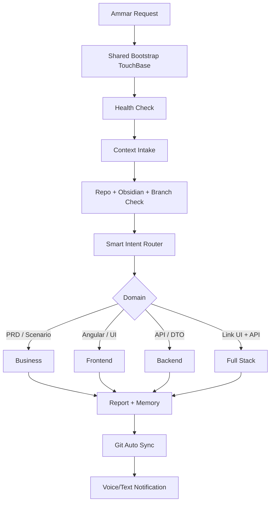

# Brain SK Execution Chart

```mermaid
flowchart TD
    A[Ammar Request] --> B[Shared Bootstrap TouchBase]
    B --> B1[Health Check]
    B1 --> B2[Context Intake]
    B2 --> B3[Repo + Obsidian + Branch Check]
    B3 --> C[Smart Intent Router]

    C --> D{Domain}
    D -->|PRD / Scenario| E[Business]
    D -->|Angular / UI| F[Frontend]
    D -->|API / DTO| G[Backend]
    D -->|Link UI + API| H[Full Stack]

    E --> I[Report + Memory]
    F --> I
    G --> I
    H --> I

    I --> J[Git Auto Sync]
    J --> K[Voice/Text Notification]
```
