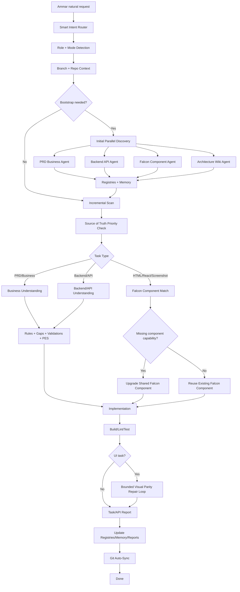

# Brain SK Flow Chart

```mermaid
flowchart TD
    A[Ammar natural request] --> B[Smart Intent Router]
    B --> C[Role + Mode Detection]
    C --> D[Branch + Repo Context]
    D --> E{Bootstrap needed?}

    E -->|Yes| F[Initial Parallel Discovery]
    F --> F1[PRD Business Agent]
    F --> F2[Backend API Agent]
    F --> F3[Falcon Component Agent]
    F --> F4[Architecture Wiki Agent]
    F1 --> G[Registries + Memory]
    F2 --> G
    F3 --> G
    F4 --> G

    E -->|No| H[Incremental Scan]
    G --> H
    H --> I[Source of Truth Priority Check]
    I --> J{Task Type}

    J -->|PRD/Business| K[Business Understanding]
    J -->|Backend/API| L[Backend/API Understanding]
    J -->|HTML/React/Screenshot| M[Falcon Component Match]

    K --> N[Rules + Gaps + Validations + PES]
    L --> N
    M --> O{Missing component capability?}
    O -->|Yes| P[Upgrade Shared Falcon Component]
    O -->|No| Q[Reuse Existing Falcon Component]

    N --> R[Implementation]
    P --> R
    Q --> R
    R --> S[Build/Lint/Test]
    S --> T{UI task?}
    T -->|Yes| U[Bounded Visual Parity Repair Loop]
    T -->|No| V[Task/API Report]
    U --> V
    V --> W[Update Registries/Memory/Reports]
    W --> X[Git Auto-Sync]
    X --> Y[Done]
```
