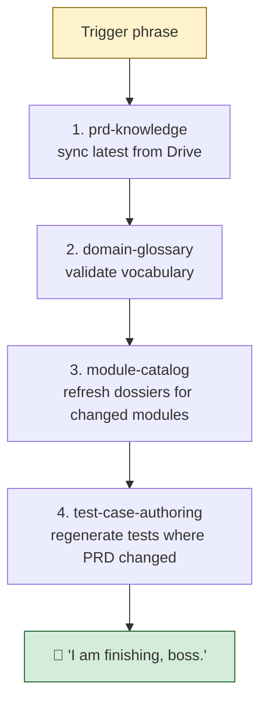

*** Skill: business-pipeline ***
*** Single-trigger orchestrator: runs prd-knowledge → domain-glossary → module-catalog → test-case-authoring in order ***

# business-pipeline

## Purpose

One trigger phrase activates the FULL business-skill chain in the correct order. Inherits everything from the OLD `business-prd-skill` working contract while leveraging the 4 split skills.

## Triggers

- `run business`
- `do business`
- `business pipeline`
- `full business sync`
- `business everything`
- `business run`

## Pipeline (sequential)



| Stage | Skill | Action | Skip when |
|---|---|---|---|
| 1 | prd-knowledge | sync from Drive (`take latest from PRD`) | Drive unreachable → STOP entire pipeline |
| 2 | domain-glossary | validate any new terms in updated PRDs | no new terms detected |
| 3 | module-catalog | refresh dossier `links.md` + `last-updated` for changed modules | no modules changed by step 1 |
| 4 | test-case-authoring | regenerate `test-cases.md` for modules with new/changed PRDs | only modules with changes |

## Sub-skills called

This skill does NOT duplicate logic — it **delegates** to:

- [prd-knowledge](../prd-knowledge/Skill.md) — full Drive sync, OVERWRITE rule, v<number> selection
- [domain-glossary](../domain-glossary/Skill.md) — En/Ar consistency
- [module-catalog](../module-catalog/Skill.md) — per-module dossiers
- [test-case-authoring](../test-case-authoring/Skill.md) — 7-type coverage, Gherkin + TC-MOD-TYPE-### IDs

Each sub-skill plays its own announcer cycle (voice + per-skill beep). The orchestrator wraps them with its own announcement at start and end.

## Status Announcer (voice + sound)

Source of truth: [`settings/sound/settings.json`](../../settings/sound/settings.json) → `skills.business-pipeline`.

| Phase | Voice | Phrase | Beep |
|---|---|---|---|
| Activation | `bf_emma` | "Business pipeline running." | — |
| Per-stage | (each sub-skill plays its own announcer) | — | per sub-skill |
| Completion | `bf_emma` | "Business pipeline complete." | rising fanfare `[440,200; 660,200; 880,200; 1100,400]` |
| **Global handshake** | `bm_george` | **"I am finishing, boss."** | double-tap `[1320,100; 1320,100]` |

Voice is `bf_emma` (British female) so the orchestrator is sonically distinct from the four British-male sub-skills.

## Hard rules

1. Never run a sub-skill out of order — dependency chain is: PRD → glossary → catalog → tests
2. If any sub-skill fails, STOP the pipeline and report which stage failed
3. Skip stages whose inputs did not change (silent pass)
4. Never edit application code, install packages, or run migrations
5. Only knowledge files in `business-skills/**` may be touched

## Output (required completion report)

```
Business pipeline complete (YYYY-MM-DD HH:MM)
Stage 1 (prd-knowledge):       N modules synced (added: X, updated: Y, unchanged: Z)
Stage 2 (domain-glossary):     N new terms validated, M flagged
Stage 3 (module-catalog):      N dossiers refreshed
Stage 4 (test-case-authoring): N modules' tests regenerated

Skills refreshed: prd-knowledge, domain-glossary, module-catalog, test-case-authoring
```

## See also

- [resources/orchestration-rules.md](./resources/orchestration-rules.md) (TBD)
- All 4 sub-skills' Skill.md files
