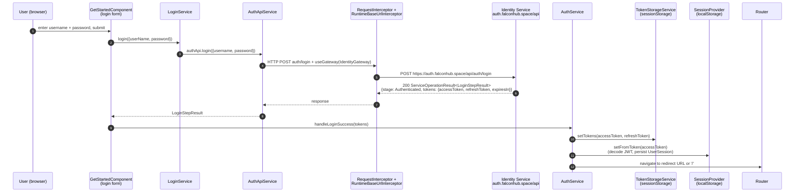
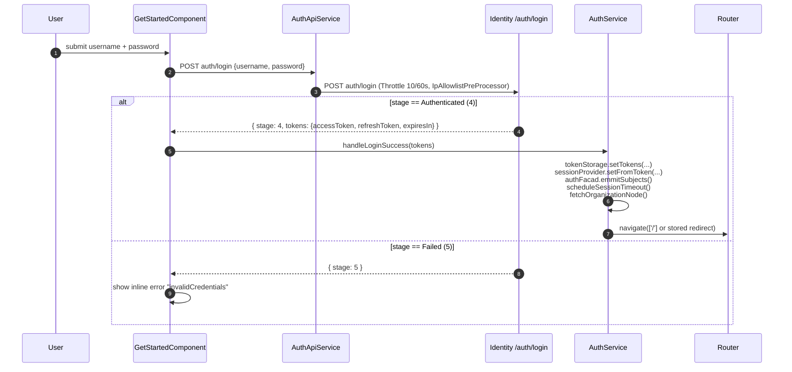
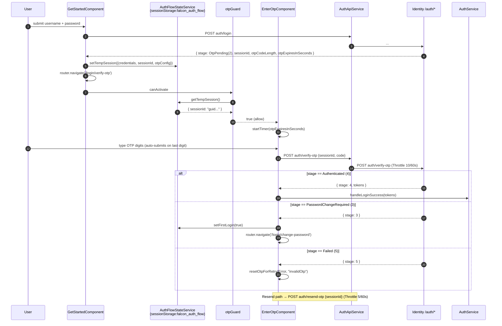
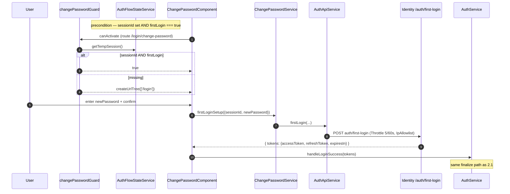
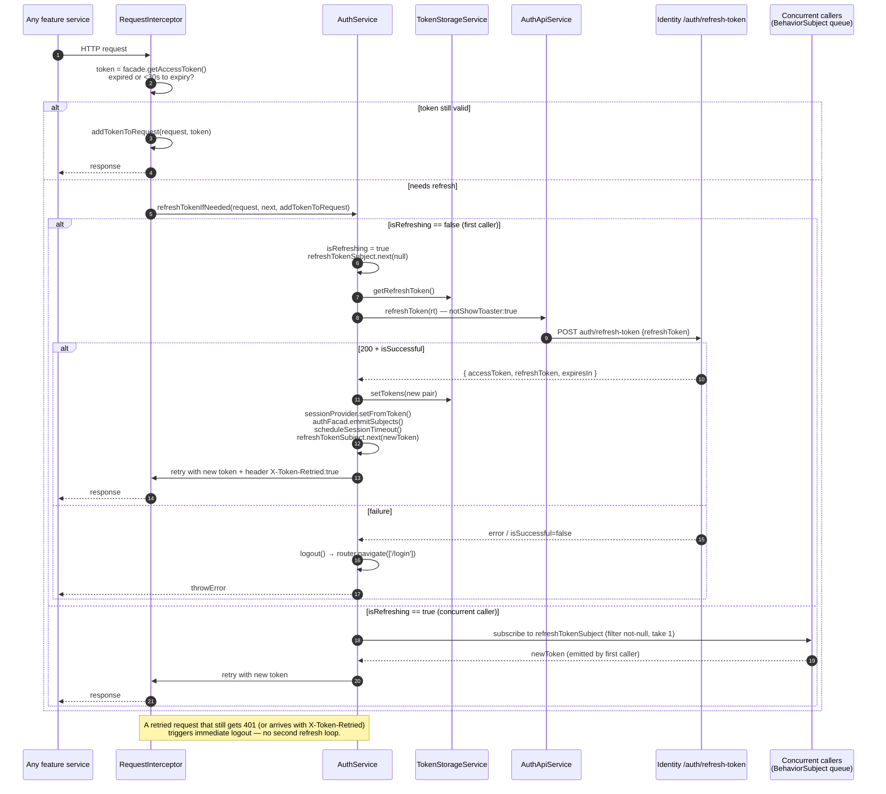
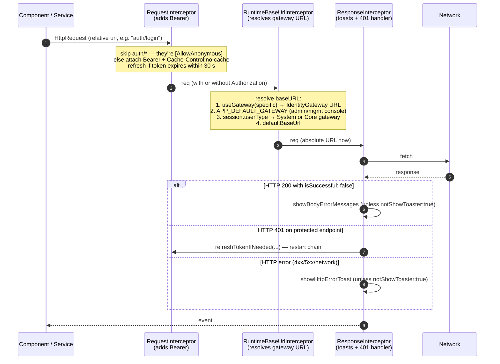
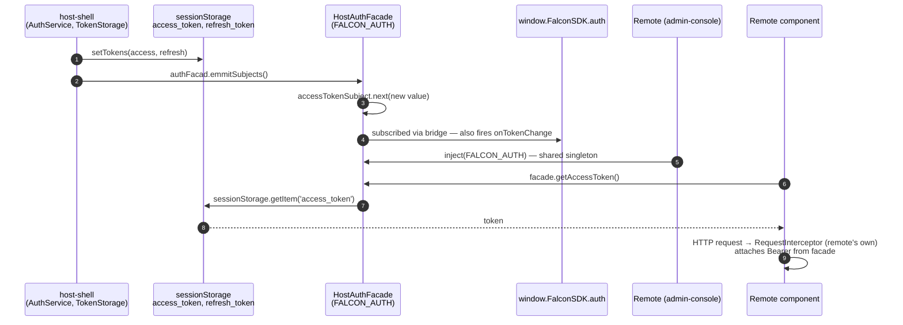

# Auth Flow Architecture — Falcon Web Platform

> The permanent answer to **"how does authentication work end-to-end?"**

This document is grounded in real code. Every claim has a file citation. Where a question could not be answered from the code, it is flagged `INFERRED` so the reader can verify.

---

## 0. Big picture (one paragraph)

The browser authenticates against the **Falcon Identity Service** at `https://auth.falconhub.space/api/auth/*` — **never against Zitadel directly** (rule [R-XC-002](../../rules/cross-cutting/R-XC-002-frontend-never-calls-zitadel.md)). Login is a multi-step state machine (`AuthenticationStage` enum) that may require OTP and/or password change before tokens are issued. Once issued, the JWT pair (`accessToken`, `refreshToken`) lives in **`sessionStorage`** under the keys `access_token` / `refresh_token`. A `RequestInterceptor` proactively refreshes the access token 30 s before expiry; a `ResponseInterceptor` reacts to `401` on protected endpoints by retrying after a refresh. Tokens are exposed to Module Federation remotes via the `FALCON_AUTH` facade (`HostAuthFacade` reads from the same `sessionStorage` keys). Auth-flow transient state (sessionId, OTP config, credentials) lives in `sessionStorage` under `falcon_auth_flow` for the duration of the login wizard.

---

## 1. TL;DR — Happy-path sequence



**Key files**: [`get-started.component.ts`](../../../../Falcon/falcon-web-platform-ui/apps/host-shell/src/app/features/auth/get-started/get-started.component.ts), [`auth-api.service.ts`](../../../../Falcon/falcon-web-platform-ui/apps/host-shell/src/app/core/auth/auth-api.service.ts), [`auth.service.ts:107-137`](../../../../Falcon/falcon-web-platform-ui/apps/host-shell/src/app/core/auth/auth.service.ts), [`token-storage.service.ts`](../../../../Falcon/falcon-web-platform-ui/apps/host-shell/src/app/core/auth/token-storage.service.ts), [`session-provider.service.ts`](../../../../Falcon/falcon-web-platform-ui/libs/falcon/src/core/lib/services/session-provider.service.ts).

---

## 2. The 5 auth flows

The backend models login as a state machine. The frontend interprets `LoginStepResult.stage` (enum `AuthenticationStage`) on every response to decide where to navigate next.

```ts
// apps/host-shell/src/app/core/auth/auth.models.ts:6-13
export enum AuthenticationStage {
  PasswordPending = 1,
  OtpPending = 2,
  PasswordChangeRequired = 3,
  Authenticated = 4,
  Failed = 5,
  OtpVerified = 6,
}
```

Stage transitions: `1 → (2 OTP)? → (3 ChangePassword)? → 4 Authenticated`. Stage `5` = Failed.

### 2.1 First-time login (email + password) — no OTP, no first-login password change



**Source**: [`get-started.component.ts:79-131`](../../../../Falcon/falcon-web-platform-ui/apps/host-shell/src/app/features/auth/get-started/get-started.component.ts), [`auth.service.ts:107-137`](../../../../Falcon/falcon-web-platform-ui/apps/host-shell/src/app/core/auth/auth.service.ts).

### 2.2 OTP verification (post-login)



**Source**: [`enter-otp.component.ts`](../../../../Falcon/falcon-web-platform-ui/apps/host-shell/src/app/features/auth/enter-otp/enter-otp.component.ts) (full file), [`otp.service.ts`](../../../../Falcon/falcon-web-platform-ui/apps/host-shell/src/app/features/auth/enter-otp/services/otp.service.ts), [`otp.guard.ts`](../../../../Falcon/falcon-web-platform-ui/apps/host-shell/src/app/features/auth/guards/otp.guard.ts), [`auth-flow-state.service.ts`](../../../../Falcon/falcon-web-platform-ui/apps/host-shell/src/app/features/auth/services/auth-flow-state.service.ts).

### 2.3 Forgot password (recovery)

Three-step wizard inside a **single component** (`ForgotPasswordFlowComponent`) using a `FlowStep` enum: `Form → Otp → ResetPassword`. No router navigation between steps.

```mermaid
sequenceDiagram
    autonumber
    participant U as User
    participant F as ForgotPasswordFlowComponent
    participant FS as ForgotPasswordFlowService
    participant API as AuthApiService
    participant ID as Identity /auth/*
    participant R as Router

    U->>F: enter username + phone, submit (Step 1)
    F->>FS: requestOtp({userName, phoneNumber, deliveryMethod:2 /*SMS*/})
    FS->>API: forgotPassword(...)
    API->>ID: POST auth/forgot-password (Throttle 5/60s, IpAllowlist)
    ID-->>F: { sessionId, otpCodeLength, otpExpiresInSeconds }
    F->>F: currentStep = Otp; startTimer(...)

    U->>F: enter OTP digits (Step 2)
    F->>FS: verifyOtp({sessionId, otp})
    FS->>API: verifyOtp({sessionId, code})
    API->>ID: POST auth/verify-otp
    ID-->>F: { isSuccessful: true, result.sessionId }
    F->>F: currentStep = ResetPassword (after 1.5 s success animation)

    U->>F: enter newPassword + confirm (Step 3)
    F->>FS: setNewPassword({sessionId, newPassword})
    FS->>API: forgotPasswordSetPassword(...)
    API->>ID: POST auth/forgot-password/set-password (Throttle 5/60s)
    ID-->>F: { isSuccessful: true, result: true }
    F->>R: router.navigate(['/login'])
```

**Source**: [`forgot-password-flow.component.ts`](../../../../Falcon/falcon-web-platform-ui/apps/host-shell/src/app/features/auth/forgot-password-flow/forgot-password-flow.component.ts) lines 60-444, [`forgot-password-flow.service.ts`](../../../../Falcon/falcon-web-platform-ui/apps/host-shell/src/app/features/auth/forgot-password-flow/services/forgot-password-flow.service.ts).

Note the wizard reuses **the same `auth/verify-otp` endpoint** as the post-login OTP flow — the backend differentiates by the `sessionId`'s origin.

### 2.4 Change password — first-login flow only

The `ChangePasswordComponent` supports two modes (`isFirstLoginMode` flag from `AuthFlowStateService`). **Only the first-login mode is wired today**: the "regular logged-in change password" branch falls through to `router.navigate(['/login'])` — there is no `auth/change-password` endpoint in the current codebase (only `auth/first-login` and `auth/set-password`). See [Open Questions](#13-open-questions).



**Source**: [`change-password.component.ts`](../../../../Falcon/falcon-web-platform-ui/apps/host-shell/src/app/features/auth/change-password/change-password.component.ts), [`change-password.service.ts`](../../../../Falcon/falcon-web-platform-ui/apps/host-shell/src/app/features/auth/change-password/services/change-password.service.ts), [`change-password.guard.ts`](../../../../Falcon/falcon-web-platform-ui/apps/host-shell/src/app/features/auth/guards/change-password.guard.ts).

### 2.5 Refresh token (expired access token)



**Source**: [`auth.service.ts:207-276`](../../../../Falcon/falcon-web-platform-ui/apps/host-shell/src/app/core/auth/auth.service.ts), [`request-interceptor.ts`](../../../../Falcon/falcon-web-platform-ui/apps/host-shell/src/app/core/interceptors/request-interceptor.ts), [`response-interceptor.ts:84-132`](../../../../Falcon/falcon-web-platform-ui/apps/host-shell/src/app/core/interceptors/response-interceptor.ts).

The **30-second buffer** in `RequestInterceptor.isTokenExpired` ([line 19-22](../../../../Falcon/falcon-web-platform-ui/apps/host-shell/src/app/core/interceptors/request-interceptor.ts)) is a proactive refresh — it prevents the token from expiring mid-flight on slow requests.

---

## 3. HTTP interceptor chain

The host shell registers **three** `HTTP_INTERCEPTORS` in `app.config.ts` (multi: true), executed in registration order on the request, reverse order on the response:



**Order in `app.config.ts:83-101`** (registration order = request order):
1. `RequestInterceptor` (auth/Bearer + refresh)
2. `RuntimeBaseUrlInterceptor` (gateway URL routing, from `@falcon`)
3. `ResponseInterceptor` (toast + 401 handler)

**Source**: [`app.config.ts:64-101`](../../../../Falcon/falcon-web-platform-ui/apps/host-shell/src/app/app.config.ts), [`request-interceptor.ts`](../../../../Falcon/falcon-web-platform-ui/apps/host-shell/src/app/core/interceptors/request-interceptor.ts), [`response-interceptor.ts`](../../../../Falcon/falcon-web-platform-ui/apps/host-shell/src/app/core/interceptors/response-interceptor.ts), [`runtime-base-url.interceptor.ts`](../../../../Falcon/falcon-web-platform-ui/libs/falcon/src/shared-data-access/lib/interceptors/runtime-base-url.interceptor.ts).

### Header conventions

| Header | Set by | Effect |
|---|---|---|
| `Authorization: Bearer <jwt>` | `AuthService.addTokenToRequest` | All non-auth/* requests |
| `Cache-Control: no-cache` | `AuthService.addTokenToRequest` | Sent alongside Bearer |
| `notShowToaster: 'true'` | Per-call, e.g. `auth/login`, `auth/refresh-token` | Suppresses toast on success+error, components show inline banner instead |
| `X-Token-Retried: 'true'` | `AuthService.refreshTokenIfNeeded` | Marks a request that has already been retried after a refresh — second 401 → logout instead of a refresh loop |
| `ngrok-skip-browser-warning: 'true'` | `RequestInterceptor` when `environment.useNgrok` | Dev-only |

---

## 4. Route guards

| Guard | Type | File | Behavior |
|---|---|---|---|
| `authGuard` | `CanActivateFn` | [`apps/host-shell/.../core/guards/auth.guard.ts`](../../../../Falcon/falcon-web-platform-ui/apps/host-shell/src/app/core/guards/auth.guard.ts) | True if `AuthService.authenticated` (= `tokenStorage.hasValidAccessToken()`, JWT `exp * 1000 > now`). Else redirects to `/login`. **Visual-test bypass**: `?visual-test=1` query (persisted in sessionStorage) short-circuits to `true`. |
| `shellPrimeAccessGuard` | `CanActivateFn` | [`libs/falcon/.../access-control/shell-access.guard.ts:36-50`](../../../../Falcon/falcon-web-platform-ui/libs/falcon/src/core/lib/access-control/shell-access.guard.ts) | Runs after `authGuard`. Calls `AccessControlFacade.ensure(SHELL_CORE_ACCESS)` to preload PES (Policy Enforcement Service) decisions for the user's core permissions. Returns `/error` on failure. |
| `shellAccessGuard` | `CanActivateFn` | same file, line 52-56 | Reads `route.data.access` (AccessQuery), calls `facade.ensure(queries)`, returns `/401` (Unauthorized) if any query denied. |
| `shellAccessMatchGuard` | `CanMatchFn` | same file, line 58-62 | Same logic as `shellAccessGuard` but for `canMatch` — used on lazy-loaded route entries (used heavily by Module Federation remotes). |
| `otpGuard` | `CanActivateFn` | [`apps/host-shell/.../features/auth/guards/otp.guard.ts`](../../../../Falcon/falcon-web-platform-ui/apps/host-shell/src/app/features/auth/guards/otp.guard.ts) | True if `AuthFlowStateService.getTempSession().sessionId` exists. Else `/login`. Protects `/login/verify-otp` so the user cannot deep-link without first hitting the login form. |
| `changePasswordGuard` | `CanActivateFn` | [`apps/host-shell/.../features/auth/guards/change-password.guard.ts`](../../../../Falcon/falcon-web-platform-ui/apps/host-shell/src/app/features/auth/guards/change-password.guard.ts) | True if `sessionId` AND `firstLogin === true`. Else `/login`. Protects `/login/change-password` — only enterable from the OTP step that flagged `PasswordChangeRequired`. |
| `adminOrganizationHierarchyGuard` | `CanActivateFn` | `libs/falcon/.../guards/admin-organization-hierarchy.guard.ts` | Page-scoped access guard — out of scope here. |

**Visual-test bypass note**: Both `authGuard` and `shellPrimeAccessGuard` honour a `?visual-test=1` URL flag (persisted in `sessionStorage` as `falcon-visual-test`). This is the pixel-diff harness escape hatch; it must remain forward-only and is never set in production builds.

---

## 5. Token storage — verified from code

The token storage is **`sessionStorage`** (not localStorage, not HTTP-only cookies, not memory). Verified by reading [`token-storage.service.ts`](../../../../Falcon/falcon-web-platform-ui/apps/host-shell/src/app/core/auth/token-storage.service.ts):

```ts
private readonly ACCESS_TOKEN_KEY = 'access_token';
private readonly REFRESH_TOKEN_KEY = 'refresh_token';

getAccessToken(): string | null {
  return sessionStorage.getItem(this.ACCESS_TOKEN_KEY);
}
// ...
setTokens(accessToken: string, refreshToken: string | null): void {
  sessionStorage.setItem(this.ACCESS_TOKEN_KEY, accessToken);
  if (refreshToken) sessionStorage.setItem(this.REFRESH_TOKEN_KEY, refreshToken);
}
```

| Key | Storage | Owner | Lifetime |
|---|---|---|---|
| `access_token` | `sessionStorage` | `TokenStorageService` + read by `HostAuthFacade` | Tab session; expires when JWT `exp` passes |
| `refresh_token` | `sessionStorage` | `TokenStorageService` | Tab session; rotated on every refresh |
| `id_token` | `sessionStorage` | `HostAuthFacade.getIdToken()` reads `sessionStorage.getItem('id_token')` | Read-only on the frontend today — **INFERRED: nothing in the current host-shell writes `id_token`**, so it's likely a future-use slot or set by an older flow. |
| `falcon_auth_flow` | `sessionStorage` | `AuthFlowStateService` | Auth wizard duration; cleared on `clear()` after `handleLoginSuccess` or back-to-login |
| `auth_redirect` | `sessionStorage` | `AuthService.login()` writes, `handleLoginSuccess` reads | Base64-encoded path the user was visiting before being bounced to `/login`. One-shot. |
| `falcon_user_session` | **`localStorage`** | `SessionProvider` (JWT-decoded UserSession) | Persists across tabs and sessions for the same browser |
| `falcon_org_node` | **`localStorage`** | `SessionProvider.setNode` | Persists across tabs and sessions |
| `falcon-visual-test` | `sessionStorage` | Visual-test guards | Pixel-diff harness only |

**Why `sessionStorage` and not `localStorage` for tokens?** `sessionStorage` is per-tab — closing the tab logs out. `localStorage` would persist across tabs/restarts. The current choice trades cross-tab SSO for slightly lower XSS exposure window (still vulnerable to XSS — see [Anti-patterns](#12-anti-patterns)).

**Sources**: [`token-storage.service.ts`](../../../../Falcon/falcon-web-platform-ui/apps/host-shell/src/app/core/auth/token-storage.service.ts), [`host-auth.facade.ts`](../../../../Falcon/falcon-web-platform-ui/apps/host-shell/falcon-facades/host-auth.facade.ts), [`session-provider.service.ts:42-43,166`](../../../../Falcon/falcon-web-platform-ui/libs/falcon/src/core/lib/services/session-provider.service.ts), [`auth-flow-state.service.ts:25`](../../../../Falcon/falcon-web-platform-ui/apps/host-shell/src/app/features/auth/services/auth-flow-state.service.ts).

---

## 6. Identity Service contract

**Base URL**: `https://auth.falconhub.space/api/` (env: `baseURLIdentityGateway`). Staging: `https://auth-staging.falconhub.space/api/`. Local override commented out at `http://localhost:7777/api/` in [`environment.ts:24`](../../../../Falcon/falcon-web-platform-ui/apps/host-shell/src/environments/environment.ts).

**Routing**: All `AuthApiService` calls set `useGateway(Gateway.IdentityGateway)` on the request `HttpContext`. The `RuntimeBaseUrlInterceptor` reads this and rewrites the URL to `baseURLIdentityGateway`.

**Endpoint group**: `auth/*` (FastEndpoints `Group<AuthEndpointGroup>` registered at [`AuthEndpointGroup.cs:15`](../../../../Falcon/falcon-core-identity-svc/src/Falcon.Identity.Api/Endpoints/Auth/AuthEndpointGroup.cs)).

| Method | Path | Frontend caller | Auth | Throttle | Pre-processor | Role |
|---|---|---|---|---|---|---|
| `POST` | `auth/login` | `AuthApiService.login` | `[AllowAnonymous]` | 10/60s | `IpAllowlistPreProcessor<LoginRequest>` (resolves tenant by username) | Submit credentials, returns `LoginStepResult{stage, sessionId, requiresOtp, requiresPasswordChange, otpCodeLength, otpExpiresInSeconds, tokens?}` |
| `POST` | `auth/verify-otp` | `AuthApiService.verifyOtp` | `[AllowAnonymous]` | 10/60s | `IpAllowlistPreProcessor<VerifyOtpRequest>` (by sessionId) | Verify OTP code; same `LoginStepResult` envelope |
| `POST` | `auth/resend-otp` | `AuthApiService.resendOtp` | `[AllowAnonymous]` | 5/60s | `IpAllowlistPreProcessor<ResendOtpRequest>` | Resend OTP; returns refreshed `otpCodeLength` + `otpExpiresInSeconds` |
| `POST` | `auth/forgot-password` | `AuthApiService.forgotPassword` | `[AllowAnonymous]` | 5/60s | `IpAllowlistPreProcessor<ForgotPasswordRequest>` | Start recovery; body: `{username, phoneNumber, deliveryMethod: 1=Email \| 2=SMS \| 3=Both}` |
| `POST` | `auth/forgot-password/set-password` | `AuthApiService.forgotPasswordSetPassword` | `[AllowAnonymous]` | 5/60s | `IpAllowlistPreProcessor<ForgotPasswordSetPasswordRequest>` | Final password set after recovery OTP verified; returns `bool` |
| `POST` | `auth/set-password` | `AuthApiService.setPassword` | `[AllowAnonymous]` | 5/60s | `IpAllowlistPreProcessor<SetPasswordRequest>` | Set password (forgot-password variant — note both `set-password` and `forgot-password/set-password` exist; the frontend wires `setPassword` but does not appear to call it in current flows. See [Open Questions](#13-open-questions)) |
| `POST` | `auth/first-login` | `AuthApiService.firstLogin` | `[AllowAnonymous]` | 5/60s | `IpAllowlistPreProcessor<FirstLoginSetupRequest>` | First-login forced password change; **returns tokens** |
| `POST` | `auth/refresh-token` | `AuthApiService.refreshToken` | `[AllowAnonymous]` | 20/60s | none | Rotate access + refresh token; called from interceptor |
| `POST` | `auth/logout` | **none in frontend** — INFERRED unused | `[AllowAnonymous]` | 10/60s | none | Backend logout endpoint. The current frontend `AuthService.logout()` is purely client-side (clear sessionStorage + redirect); it does **not** call `auth/logout`. |

**Sources**:
- Endpoints (Identity Service): [`apps/host-shell/.../core/auth/auth-api.service.ts`](../../../../Falcon/falcon-web-platform-ui/apps/host-shell/src/app/core/auth/auth-api.service.ts) ↔ [`falcon-core-identity-svc/src/.../Endpoints/Auth/*.cs`](../../../../Falcon/falcon-core-identity-svc/src/Falcon.Identity.Api/Endpoints/Auth/).
- Gateway enum: [`libs/falcon/src/shared-types/lib/enums/globels.ts:126-130`](../../../../Falcon/falcon-web-platform-ui/libs/falcon/src/shared-types/lib/enums/globels.ts) (`Gateway.IdentityGateway = 4`).
- Gateway path map: [`runtime-api-config.ts:120`](../../../../Falcon/falcon-web-platform-ui/libs/falcon/src/shared-data-access/lib/runtime-config/runtime-api-config.ts) (`[Gateway.IdentityGateway]: 'baseURLIdentityGateway'`).

### Why are auth endpoints `[AllowAnonymous]`?

The login flow itself is anonymous by definition — the client doesn't have a token yet. The `RequestInterceptor` explicitly **skips token attachment** for any URL containing `/auth/` ([`request-interceptor.ts:36-41`](../../../../Falcon/falcon-web-platform-ui/apps/host-shell/src/app/core/interceptors/request-interceptor.ts)), and the `ResponseInterceptor` **skips 401-refresh on `/auth/*`** ([`response-interceptor.ts:101-107`](../../../../Falcon/falcon-web-platform-ui/apps/host-shell/src/app/core/interceptors/response-interceptor.ts)) because a `401` on `auth/login` means "wrong credentials", not "token expired".

---

## 7. Why the indirection? — frontend never calls Zitadel directly

> Per [R-XC-002](../../rules/cross-cutting/R-XC-002-frontend-never-calls-zitadel.md) and `feedback_frontend_auth_identity_service` ([memory file](../../../../Users/User/.claude/projects/C--Falcon/memory/feedback_frontend_auth_identity_service.md)):
>
> The Falcon frontend MUST NOT call Zitadel directly. All authentication, token refresh, OTP, password, and lifecycle flows go through the **Identity Service** (`falcon-core-identity-svc`) via the **Identity Gateway** at `https://auth.falconhub.space/api/`.

**Reasons (cross-referenced to Security-Architecture.md and R-XC-001):**

1. **Identity owns user lifecycle** — Pending / Active / Suspended / Locked / Deleted states are stored and enforced in `falcon-core-identity-svc`, not in Zitadel. A frontend talking to Zitadel would bypass these gates.
2. **Tenant + IP allowlist enforcement** — Every auth endpoint runs `IpAllowlistPreProcessor`, which resolves the tenant (by username / sessionId / userId) and validates the client IP against `TenantSettings.AllowedIps`. This logic cannot run in Zitadel.
3. **Custom claims in JWT** — `tenant_id`, `user_type`, `nodeId`, `urn:zitadel:iam:user:metadata.user-id` are populated by Identity, not by stock Zitadel. The frontend depends on them ([`session-provider.service.ts:97-150`](../../../../Falcon/falcon-web-platform-ui/libs/falcon/src/core/lib/services/session-provider.service.ts)).
4. **Decoupling** — frontend stays Zitadel-agnostic. Swapping Zitadel for another IdP would be a backend change only.
5. **OTP delivery** — SMS / Email OTP delivery is orchestrated by Identity (see `EmailCodeGeneratedDomainEvent` / `SmsCodeGeneratedDomainEvent` in `Application/Auth/DomainEvents/`). Zitadel doesn't deliver SMS for Falcon's tenant policies.

**Verification**: a workspace-wide grep for `zitadel`, `oidc-client`, `angular-auth-oidc-client`, `\.well-known/openid-configuration` returned **zero matches** in `apps/` and `libs/` frontend source (excluding node_modules, dist, deprecated trees). No OIDC redirect-flow library is installed (`package.json` shows only `jwt-decode@^3.1.2`).

---

## 8. IP allowlist + MFA

### IP allowlist (Identity-Service-side, frontend surfaces error)

Every login/OTP/forgot-password/set-password/first-login endpoint runs `IpAllowlistPreProcessor<TRequest>` ([`IpAllowlistPreProcessor.cs`](../../../../Falcon/falcon-core-identity-svc/src/Falcon.Identity.Api/Endpoints/Auth/PreProcessors/IpAllowlistPreProcessor.cs)). Each protected request type implements `IIpAllowlistProtected` and declares a `TenantResolutionStrategy` (`ByUsername` / `BySessionId` / `ByUserId`). The pre-processor:

1. Resolves tenant via `ITenantIdResolver`.
2. Reads `RemoteIpAddress` from the HTTP context.
3. Calls `IIpAllowlistGuard.ValidateAsync(tenantId, clientIp)`.
4. **Throws `FalconException` if the IP is not allowed** → returned to the client as a non-2xx response.

**Frontend handling**: `ResponseInterceptor.handleErrorResponse` extracts `body.ErrorMessages / errorMessages / Errors / errors` (camelCase or PascalCase) or `body.Message / message` from the error body and shows it via `FalconMessageService` toast unless `notShowToaster: 'true'` is set. On `auth/login`, the toast is suppressed and `GetStartedComponent.extractHttpError` ([`get-started.component.ts:152-180`](../../../../Falcon/falcon-web-platform-ui/apps/host-shell/src/app/features/auth/get-started/get-started.component.ts)) shows the message in an inline banner — so an "IP not allowed" message from the backend renders inline on the login form.

The frontend has no special-case branch for IP allowlist denial — it relies on the backend `FalconException.Message` being human-readable.

### MFA

Today's "MFA" surface = OTP (SMS) as a second factor. The flow is:

1. `auth/login` returns `stage: OtpPending(2)` + `otpCodeLength` + `otpExpiresInSeconds`.
2. Frontend navigates to `/login/verify-otp` via `otpGuard`.
3. `EnterOtpComponent` runs a countdown and submits to `auth/verify-otp`.

There is **no TOTP / authenticator-app / WebAuthn / hardware-key path** in the current frontend. OTP delivery method is fixed to SMS for forgot-password (`deliveryMethod: 2` hardcoded in [`forgot-password-flow.component.ts:91`](../../../../Falcon/falcon-web-platform-ui/apps/host-shell/src/app/features/auth/forgot-password-flow/forgot-password-flow.component.ts)) — `Email(1)` and `Both(3)` are wired in the model but no UI exposes them.

`AuthSessionResult.isMfaRequired` exists in the model ([`auth.models.ts:71`](../../../../Falcon/falcon-web-platform-ui/apps/host-shell/src/app/core/auth/auth.models.ts)) but is unread by the current code paths — likely a future-use slot. **INFERRED**: the flag is set up to allow a future "PasswordPending → MfaPending → OtpPending" expansion of `AuthenticationStage`.

---

## 9. Session expiry handling — what happens when refresh fails

### Three failure modes

1. **`RequestInterceptor` finds the token expired AND already retried** (`X-Token-Retried` header present): immediate `AuthService.logout()` ([`request-interceptor.ts:46-51`](../../../../Falcon/falcon-web-platform-ui/apps/host-shell/src/app/core/interceptors/request-interceptor.ts)).
2. **`AuthService.refreshTokenIfNeeded` — no refresh token in storage**: immediate `logout()` ([`auth.service.ts:218-223`](../../../../Falcon/falcon-web-platform-ui/apps/host-shell/src/app/core/auth/auth.service.ts)).
3. **`auth/refresh-token` returns error OR `isSuccessful: false`**: immediate `logout()` ([`auth.service.ts:256-266`](../../../../Falcon/falcon-web-platform-ui/apps/host-shell/src/app/core/auth/auth.service.ts)).
4. **`scheduleSessionTimeout` fires (token reached `exp`)**: `logout()` runs in NgZone ([`auth.service.ts:159-179`](../../../../Falcon/falcon-web-platform-ui/apps/host-shell/src/app/core/auth/auth.service.ts)). This is a wall-clock timer set outside Angular Zone (zoneless rollout), re-armed on every successful login + every refresh.

### `AuthService.logout()` — the cascade

```ts
// auth.service.ts:93-101
public logout(): void {
  this.clearSessionTimeout();                  // 1. Cancel pending auto-logout timer
  this._isAuthenticated.set(false);            // 2. Flip the auth signal
  this.tokenStorage.clearTokens();             // 3. Remove access_token + refresh_token from sessionStorage
  this.sessionProvider.clear();                // 4. Clear UserSession + OrgHierarchyNode (BehaviorSubjects + localStorage)
  this.authFlowState.clear();                  // 5. Clear falcon_auth_flow (transient login state)
  this.authFacad.emmitSubjects();              // 6. Emit null on accessToken$/idToken$ — notifies federation remotes
  this.router.navigate(['/login']);            // 7. Bounce to login
}
```

The backend `auth/logout` endpoint **is not called** — logout is purely client-side. Side effects on the server (revoking the refresh token at Zitadel, audit log entry, etc.) are not currently triggered from the frontend logout path. **INFERRED**: this is a known gap and likely needs to be addressed in a future task.

### Stored redirect

`AuthService.login(setState = true)` ([`auth.service.ts:82-88`](../../../../Falcon/falcon-web-platform-ui/apps/host-shell/src/app/core/auth/auth.service.ts)) writes a base64-encoded `window.location.pathname` to `sessionStorage.auth_redirect` before navigating to `/login`. On successful authentication, `handleLoginSuccess` ([`auth.service.ts:131-136`](../../../../Falcon/falcon-web-platform-ui/apps/host-shell/src/app/core/auth/auth.service.ts)) reads it back, removes it, and `router.navigate([decodedPath || '/'])`.

**Note**: This is set only when `authGuard` redirects an unauthenticated user mid-session. It is **not** set when the auto-logout timer fires (`logout()` is called directly there with no redirect bookmark) — losing the page the user was on. **INFERRED bug candidate**.

---

## 10. Federation considerations — how remotes get the session

Module Federation remotes (`admin-console`, `management-console`) consume auth via the **`FALCON_AUTH` injection token**, bound to the `HostAuthFacade` in the host shell. The facade interface:

```ts
// libs/sdk/src/types/falcon-facades.interfaces.ts:3-12
export interface FalconAuthFacade {
  getAuthenticationObject(): { accessToken: string | null; idToken: string | null };
  getAccessToken(): string | null;
  getIdToken(): string | null;
  emmitSubjects(): void;
}
```

### Three delivery channels

1. **DI token (`FALCON_AUTH`)** — host shell binds the concrete `HostAuthFacade` via `provideFalconFacades({ auth: HostAuthFacade, ... })` ([`app.config.ts:57-63`](../../../../Falcon/falcon-web-platform-ui/apps/host-shell/src/app/app.config.ts), [`provide-falcon-facades.ts:26-34`](../../../../Falcon/falcon-web-platform-ui/libs/sdk/src/facades/provide-falcon-facades.ts)). When a remote loads inside the host, Module Federation shares Angular and `@falcon/sdk` as singletons, so the remote's `inject(FALCON_AUTH)` resolves to the host's `HostAuthFacade` instance.

2. **`sessionStorage` direct read** — `HostAuthFacade.getAccessToken()` does `sessionStorage.getItem('access_token')` ([`host-auth.facade.ts:13-18`](../../../../Falcon/falcon-web-platform-ui/apps/host-shell/falcon-facades/host-auth.facade.ts)). Both host and remotes run in the same browser tab → same `sessionStorage` → the remote can read the token even if the DI singleton is broken.

3. **`window.FalconSDK` global** — `HostWindowSdkBridge.install()` ([`host-window-sdk.bridge.ts`](../../../../Falcon/falcon-web-platform-ui/apps/host-shell/falcon-sdk/host-window-sdk.bridge.ts)) writes a `FalconWindowSdk` object onto `window`, exposing `auth.getToken()` and `auth.onTokenChange(cb)`. This is the **non-Angular escape hatch** — vanilla JS, Stencil components, or non-Angular consumers can read the token without DI.



### Standalone remote mode

When a remote app is run standalone (i.e., not loaded by the host shell), its `app.config.ts` provides `MockAuth` via `provideFalconFallbackFacades()` ([`mocks/falcon-fallback.providers.ts`](../../../../Falcon/falcon-web-platform-ui/apps/admin-console/mocks/falcon-fallback.providers.ts)). `MockAuth` reads from the same `sessionStorage` key but returns a mock token if absent — so dev pages render with a fake user.

### What gets shared / not shared

| Asset | Shared from host to remote? | How |
|---|---|---|
| `access_token` / `refresh_token` | Yes | `sessionStorage` is per-origin per-tab |
| `FALCON_AUTH` facade instance | Yes | Module Federation `shared` config makes `@falcon/sdk` a singleton; remote injects the host's `HostAuthFacade` |
| Token refresh logic | **No — duplicated** | Remotes register their own `RequestInterceptor` / `ResponseInterceptor` with their own `HttpClient`. INFERRED: this means a remote can independently trigger `auth/refresh-token`; the BehaviorSubject queue in `AuthService` is **per-instance, per-app**, so race conditions across host + remote simultaneous refresh are possible. |
| `UserSession` (decoded JWT) | Yes | `SessionProvider` reads from `localStorage` (`falcon_user_session`) which is shared across iframes and same-origin scripts |
| `OrgHierarchyNode` | Yes | Same — `localStorage` key `falcon_org_node` |

---

## 11. Components involved

| Component | Type | Path | Role |
|---|---|---|---|
| `<falcon-otp>` (`FalconAngularOtpComponent`) | Falcon UI library | `libs/falcon-ui-core/.../falcon-otp/` — [dossier](../components/falcon-otp/) | Stencil-backed OTP digit input. Used by `EnterOtpComponent` + `ForgotPasswordFlowComponent` step 2. |
| `<falcon-otp-send-dialog>` | Falcon UI library | `libs/falcon-ui-core/.../falcon-otp-send-dialog/` — [dossier](../components/falcon-otp-send-dialog/) | Dialog used to **prompt the user to send an OTP** (e.g. to confirm a sensitive action mid-session). **Not** currently wired into the login wizard — it's a general-purpose component. |
| `change-password.component` | App component | `apps/host-shell/.../features/auth/change-password/` | First-login password change form; reactive form with cross-field `passwordMatchValidator`. |
| `forgot-password-flow.component` | App component | `apps/host-shell/.../features/auth/forgot-password-flow/` | Three-step wizard (Form → Otp → ResetPassword) in a single component, no router between steps. |
| `enter-otp.component` | App component | `apps/host-shell/.../features/auth/enter-otp/` | Post-login OTP screen. Uses `FalconAngularOtpComponent` + countdown timer + auto-submit on completion. |
| `login-layout.component` | App component | `apps/host-shell/.../features/auth/login-layout/` | Shared layout + language switcher; `<router-outlet>` for child auth screens. |
| `get-started.component` | App component | `apps/host-shell/.../features/auth/get-started/` | The login form (username + password). |
| `<falcon-password>` | Falcon UI library | `libs/falcon-ui-core/.../falcon-password/` — [dossier](../components/falcon-password/) | Password input with show/hide toggle. Used in change-password and forgot-password screens. |

---

## 12. Anti-patterns — what NOT to do

1. **Never store tokens in `localStorage`** — current choice is `sessionStorage` for tab-isolated token lifetime. Moving to `localStorage` would expand the cross-tab attack surface without an audited migration.
2. **Never call Zitadel directly** — see [section 7](#7-why-the-indirection--frontend-never-calls-zitadel-directly). Forbidden imports: `angular-auth-oidc-client`, `oidc-client-ts`, `@auth0/angular-jwt`. Forbidden refs: any URL containing `zitadel`, any 18-digit numeric `clientId` literal in env files.
3. **Never bypass the interceptor for protected endpoints** — building a request with an absolute URL skips `RuntimeBaseUrlInterceptor.resolveGatewayFromSession()` and ALSO skips the `RequestInterceptor` token attachment (because the latter only adds `Authorization` to non-`/auth/` URLs but won't differentiate gateway routing). Use `useGateway(Gateway.XGateway)` instead.
4. **Never read `sessionStorage.access_token` directly from feature code** — go through `HostAuthFacade.getAccessToken()` or `AuthService` so future migration (e.g. to HTTP-only cookies) is a one-place change.
5. **Never call `auth/refresh-token` from feature code** — it's the interceptor's job. Calling it manually breaks the `isRefreshing` / `BehaviorSubject` mutex and can spawn parallel refresh storms.
6. **Never set `Authorization: Bearer` manually on an `HttpRequest`** — the `RequestInterceptor` does this. Manual setting risks attaching a stale token (the interceptor checks expiry first).
7. **Never store passwords or OTP codes in `localStorage`** — `AuthFlowStateService` keeps credentials in `sessionStorage` for the wizard's lifetime only (cleared on `clear()` / `handleLoginSuccess`). Even `sessionStorage` is the minimum acceptable; never persist longer.
8. **Never trust `LoginStepResult.devOtpCode`** outside of dev — the backend returns the OTP for `localhost` testing only. **INFERRED**: production builds should strip this field; verify the backend gate.
9. **Never skip `notShowToaster: 'true'` on auth calls** — the `ResponseInterceptor` would show a global error toast on every wrong-password attempt; the login screen shows the error inline instead.
10. **Never put `auth/*` routes behind `authGuard`** — they'd be unreachable. Login is at `/login` and is NOT under the guarded `/` parent route in `app.routes.ts`.

---

## 13. Open questions (INFERRED — to verify)

1. **What sets `id_token` in `sessionStorage`?** — `HostAuthFacade.getIdToken()` reads `sessionStorage.getItem('id_token')`, but a workspace search shows **no writer**. `LoginStepResult.idToken` is declared in the model but `handleLoginSuccess` only stores `accessToken` + `refreshToken`. **INFERRED**: dead code, future-use slot, or set by a legacy/removed flow.
2. **`AuthApiService.setPassword` is wired but unused** — `ChangePasswordService.setPassword` exists and would call `auth/set-password`, but no UI flow today calls it. The forgot-password wizard uses `auth/forgot-password/set-password` instead. **INFERRED**: leftover from a refactor; `set-password` may exist for a future "logged-in change password" UI.
3. **`AuthSessionResult.isMfaRequired` is never read on the frontend** — declared in [`auth.models.ts:71`](../../../../Falcon/falcon-web-platform-ui/apps/host-shell/src/app/core/auth/auth.models.ts) but unused. Likely a forward-compat slot.
4. **`auth/logout` is not called from the frontend** — client-side logout only. Backend audit log + Zitadel session revocation are not triggered. Confirm whether this is intentional or a known gap.
5. **`scheduleSessionTimeout` fires `logout()` without setting `auth_redirect`** — user loses their page after auto-logout. Confirm if intentional.
6. **Refresh-token race condition across host + remotes** — each app has its own `AuthService` singleton, each owns its own `isRefreshing` flag. If host + admin-console-remote both detect a 401 simultaneously, both could fire `auth/refresh-token`. The backend rotates the refresh token, so the second caller will get `invalid_grant`. **INFERRED**: needs verification. Possible fix: centralize refresh through the `FALCON_AUTH` facade (host-only) and have remotes subscribe to `accessToken$` instead of refreshing themselves.
7. **`devOtpCode` exposure** — `LoginStepResult.devOtpCode` and `otpCode` are present in the type. Verify backend env gates them off in prod.
8. **`authGuard` short-circuits on visual-test mode** — production builds must guarantee `?visual-test=1` cannot persist across origins. Confirm the build pipeline strips or fails on this.
9. **Multi-tab token rotation** — the `RequestInterceptor` reads `sessionStorage.access_token`, but `sessionStorage` is per-tab. If a refresh happens in tab A, tab B's stored token doesn't update. Verify that this is intentional (i.e., each tab handles its own refresh) or whether `BroadcastChannel` synchronization is on the roadmap.

---

## 14. Sources of truth (file + line citations)

### Frontend (host-shell)
- [`apps/host-shell/src/app/app.config.ts`](../../../../Falcon/falcon-web-platform-ui/apps/host-shell/src/app/app.config.ts) — Facade binding, interceptor registration, SHELL_CORE_ACCESS factory (lines 50-106).
- [`apps/host-shell/src/app/app.routes.ts`](../../../../Falcon/falcon-web-platform-ui/apps/host-shell/src/app/app.routes.ts) — `authGuard` + `shellPrimeAccessGuard` on root, `/login` lazy load (line 14, 110-114).
- [`apps/host-shell/src/app/core/auth/auth-api.service.ts`](../../../../Falcon/falcon-web-platform-ui/apps/host-shell/src/app/core/auth/auth-api.service.ts) — All 9 Identity endpoints.
- [`apps/host-shell/src/app/core/auth/auth.service.ts`](../../../../Falcon/falcon-web-platform-ui/apps/host-shell/src/app/core/auth/auth.service.ts) — `handleLoginSuccess` (107-137), `logout` (93-101), `refreshTokenIfNeeded` (207-276), `scheduleSessionTimeout` (159-179).
- [`apps/host-shell/src/app/core/auth/token-storage.service.ts`](../../../../Falcon/falcon-web-platform-ui/apps/host-shell/src/app/core/auth/token-storage.service.ts) — sessionStorage keys + `hasValidAccessToken` (lines 10-47).
- [`apps/host-shell/src/app/core/auth/auth.models.ts`](../../../../Falcon/falcon-web-platform-ui/apps/host-shell/src/app/core/auth/auth.models.ts) — `AuthenticationStage`, `LoginStepResult`, DTOs.
- [`apps/host-shell/src/app/core/guards/auth.guard.ts`](../../../../Falcon/falcon-web-platform-ui/apps/host-shell/src/app/core/guards/auth.guard.ts) — `authGuard` + visual-test bypass.
- [`apps/host-shell/src/app/core/interceptors/request-interceptor.ts`](../../../../Falcon/falcon-web-platform-ui/apps/host-shell/src/app/core/interceptors/request-interceptor.ts) — Bearer attach + proactive refresh.
- [`apps/host-shell/src/app/core/interceptors/response-interceptor.ts`](../../../../Falcon/falcon-web-platform-ui/apps/host-shell/src/app/core/interceptors/response-interceptor.ts) — 401 → refresh, error toast, `X-Token-Retried` short-circuit.
- [`apps/host-shell/src/app/features/auth/auth.routes.ts`](../../../../Falcon/falcon-web-platform-ui/apps/host-shell/src/app/features/auth/auth.routes.ts) — Login child routes + guards (`otpGuard`, `changePasswordGuard`).
- [`apps/host-shell/src/app/features/auth/services/auth-flow-state.service.ts`](../../../../Falcon/falcon-web-platform-ui/apps/host-shell/src/app/features/auth/services/auth-flow-state.service.ts) — `falcon_auth_flow` sessionStorage key.
- [`apps/host-shell/src/app/features/auth/get-started/get-started.component.ts`](../../../../Falcon/falcon-web-platform-ui/apps/host-shell/src/app/features/auth/get-started/get-started.component.ts) — Login form + stage routing.
- [`apps/host-shell/src/app/features/auth/enter-otp/enter-otp.component.ts`](../../../../Falcon/falcon-web-platform-ui/apps/host-shell/src/app/features/auth/enter-otp/enter-otp.component.ts) — OTP screen.
- [`apps/host-shell/src/app/features/auth/change-password/change-password.component.ts`](../../../../Falcon/falcon-web-platform-ui/apps/host-shell/src/app/features/auth/change-password/change-password.component.ts) — First-login change-password.
- [`apps/host-shell/src/app/features/auth/forgot-password-flow/forgot-password-flow.component.ts`](../../../../Falcon/falcon-web-platform-ui/apps/host-shell/src/app/features/auth/forgot-password-flow/forgot-password-flow.component.ts) — 3-step recovery wizard.
- [`apps/host-shell/falcon-facades/host-auth.facade.ts`](../../../../Falcon/falcon-web-platform-ui/apps/host-shell/falcon-facades/host-auth.facade.ts) — `FALCON_AUTH` implementation.
- [`apps/host-shell/falcon-sdk/host-window-sdk.bridge.ts`](../../../../Falcon/falcon-web-platform-ui/apps/host-shell/falcon-sdk/host-window-sdk.bridge.ts) — `window.FalconSDK.auth` exposure.

### Frontend (libs)
- [`libs/falcon/src/core/lib/services/session-provider.service.ts`](../../../../Falcon/falcon-web-platform-ui/libs/falcon/src/core/lib/services/session-provider.service.ts) — JWT decode, `UserSession` + `OrgHierarchyNode` in localStorage.
- [`libs/falcon/src/core/lib/access-control/shell-access.guard.ts`](../../../../Falcon/falcon-web-platform-ui/libs/falcon/src/core/lib/access-control/shell-access.guard.ts) — Access-control guards.
- [`libs/falcon/src/shared-data-access/lib/interceptors/runtime-base-url.interceptor.ts`](../../../../Falcon/falcon-web-platform-ui/libs/falcon/src/shared-data-access/lib/interceptors/runtime-base-url.interceptor.ts) — Gateway routing.
- [`libs/falcon/src/shared-types/lib/enums/globels.ts`](../../../../Falcon/falcon-web-platform-ui/libs/falcon/src/shared-types/lib/enums/globels.ts) — `Gateway.IdentityGateway = 4`.
- [`libs/sdk/src/types/falcon-facades.interfaces.ts`](../../../../Falcon/falcon-web-platform-ui/libs/sdk/src/types/falcon-facades.interfaces.ts) — `FalconAuthFacade` contract.
- [`libs/sdk/src/tokens/falcon-facades.tokens.ts`](../../../../Falcon/falcon-web-platform-ui/libs/sdk/src/tokens/falcon-facades.tokens.ts) — `FALCON_AUTH` InjectionToken.
- [`libs/sdk/src/facades/provide-falcon-facades.ts`](../../../../Falcon/falcon-web-platform-ui/libs/sdk/src/facades/provide-falcon-facades.ts) — Facade binder.

### Identity Service (backend, for context only)
- [`src/Falcon.Identity.Api/Endpoints/Auth/AuthEndpointGroup.cs`](../../../../Falcon/falcon-core-identity-svc/src/Falcon.Identity.Api/Endpoints/Auth/AuthEndpointGroup.cs) — Route prefix `auth/*`.
- [`src/Falcon.Identity.Api/Endpoints/Auth/LoginEndpoint.cs`](../../../../Falcon/falcon-core-identity-svc/src/Falcon.Identity.Api/Endpoints/Auth/LoginEndpoint.cs) — `POST auth/login`, Throttle 10/60.
- [`src/Falcon.Identity.Api/Endpoints/Auth/VerifyOtpEndpoint.cs`](../../../../Falcon/falcon-core-identity-svc/src/Falcon.Identity.Api/Endpoints/Auth/VerifyOtpEndpoint.cs).
- [`src/Falcon.Identity.Api/Endpoints/Auth/ResendOtpEndpoint.cs`](../../../../Falcon/falcon-core-identity-svc/src/Falcon.Identity.Api/Endpoints/Auth/ResendOtpEndpoint.cs).
- [`src/Falcon.Identity.Api/Endpoints/Auth/ForgotPasswordEndpoint.cs`](../../../../Falcon/falcon-core-identity-svc/src/Falcon.Identity.Api/Endpoints/Auth/ForgotPasswordEndpoint.cs).
- [`src/Falcon.Identity.Api/Endpoints/Auth/ForgotPasswordSetPasswordEndpoint.cs`](../../../../Falcon/falcon-core-identity-svc/src/Falcon.Identity.Api/Endpoints/Auth/ForgotPasswordSetPasswordEndpoint.cs).
- [`src/Falcon.Identity.Api/Endpoints/Auth/SetPasswordEndpoint.cs`](../../../../Falcon/falcon-core-identity-svc/src/Falcon.Identity.Api/Endpoints/Auth/SetPasswordEndpoint.cs).
- [`src/Falcon.Identity.Api/Endpoints/Auth/FirstLoginSetupEndpoint.cs`](../../../../Falcon/falcon-core-identity-svc/src/Falcon.Identity.Api/Endpoints/Auth/FirstLoginSetupEndpoint.cs).
- [`src/Falcon.Identity.Api/Endpoints/Auth/RefreshTokenEndpoint.cs`](../../../../Falcon/falcon-core-identity-svc/src/Falcon.Identity.Api/Endpoints/Auth/RefreshTokenEndpoint.cs).
- [`src/Falcon.Identity.Api/Endpoints/Auth/LogoutEndpoint.cs`](../../../../Falcon/falcon-core-identity-svc/src/Falcon.Identity.Api/Endpoints/Auth/LogoutEndpoint.cs).
- [`src/Falcon.Identity.Api/Endpoints/Auth/PreProcessors/IpAllowlistPreProcessor.cs`](../../../../Falcon/falcon-core-identity-svc/src/Falcon.Identity.Api/Endpoints/Auth/PreProcessors/IpAllowlistPreProcessor.cs).

### Cross-cutting rules + memory
- [`Brain Outputs/understanding/rules/cross-cutting/R-XC-001-identity-owns-user-lifecycle.md`](../../rules/cross-cutting/R-XC-001-identity-owns-user-lifecycle.md).
- [`Brain Outputs/understanding/rules/cross-cutting/R-XC-002-frontend-never-calls-zitadel.md`](../../rules/cross-cutting/R-XC-002-frontend-never-calls-zitadel.md).
- [`memory/feedback_frontend_auth_identity_service.md`](../../../../Users/User/.claude/projects/C--Falcon/memory/feedback_frontend_auth_identity_service.md).

### Related architecture docs
- [`AUTH_AND_FACADE_PATTERNS.md`](./AUTH_AND_FACADE_PATTERNS.md) — Composition root patterns (host vs remote).
- [`MODULE_FEDERATION_PATTERNS.md`](./MODULE_FEDERATION_PATTERNS.md) — Federation topology.
- [`ROUTES_AND_MF_AUDIT.md`](./ROUTES_AND_MF_AUDIT.md) — Route layout per app.

---

## Verification — workspace-wide R-XC-002 check

Performed for this report (2026-05-16):

| Probe | Result |
|---|---|
| Workspace grep for `zitadel\.io`, `zitadel-`, `zitadel\.cloud`, `/oauth/v2/`, `/oidc/v1/` in `apps/` + `libs/` | **0 matches** |
| `package.json` for `angular-auth-oidc-client` / `oidc-client-ts` / `@auth0/angular-jwt` | **Not installed** (only `jwt-decode@^3.1.2`) |
| `apps/host-shell/src/environments/*.ts` for Zitadel issuer / clientId | **Not present** (only `baseURLIdentityGateway` pointing to `auth.falconhub.space/api/`) |
| All `AuthApiService` methods routed through `Gateway.IdentityGateway` | **Yes** ([auth-api.service.ts:27](../../../../Falcon/falcon-web-platform-ui/apps/host-shell/src/app/core/auth/auth-api.service.ts)) |

**Conclusion**: R-XC-002 compliant. No frontend code calls Zitadel directly. No OIDC redirect-flow library is installed.
