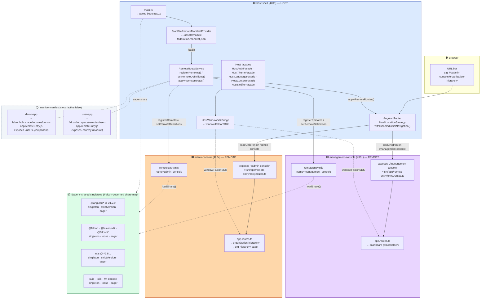
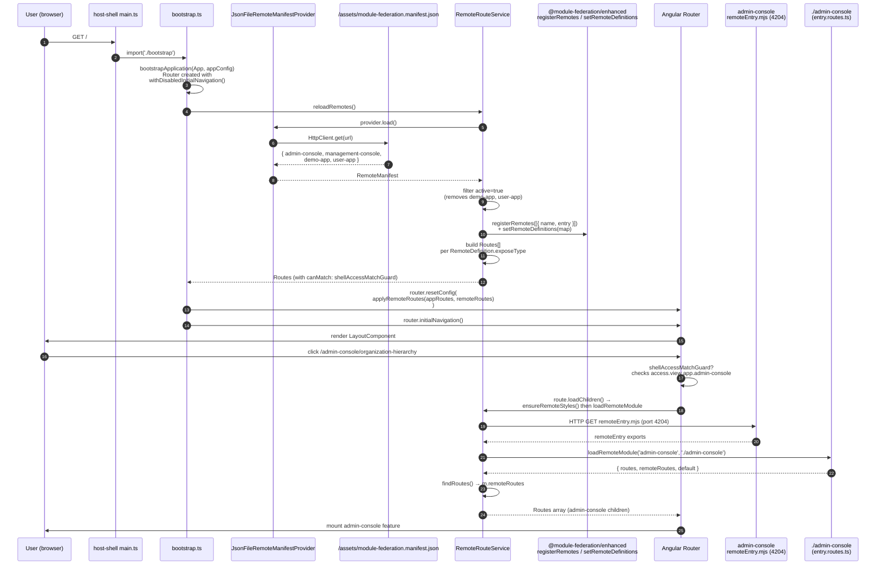

*** Module Federation Topology — Falcon Frontend ***
*** The permanent answer to "how do the 3 Angular apps work together?" ***
*** Read this before touching MF configs, remote manifests, or host-shell routing ***

# 🌐 Module Federation Topology

> One **host** (`host-shell`) and two active **remotes** (`admin-console`, `management-console`) wired via `@nx/module-federation@22.7.1` on top of `@module-federation/enhanced@2.1.0`. Remote URLs are **not baked in at build time** — they are loaded at runtime from a pluggable JSON manifest provider, then injected into the Angular router before the first navigation. Two inactive remote entries (`demo-app`, `user-app`) are reserved as external-MFE slots for later use.

---

## 1. TL;DR — topology diagram



**Sources for diagram:**
- `apps/host-shell/module-federation.config.ts:16` (`name: 'host-shell'`, `remotes: []`)
- `apps/host-shell/src/assets/module-federation.manifest.json:2-55` (the 4 remote entries — 2 active, 2 inactive)
- `apps/admin-console/module-federation.config.ts:8-12` (`name: 'admin-console'`, exposes `./admin-console`)
- `apps/management-console/module-federation.config.ts:17-20` (`name: 'management-console'`, exposes `./management-console`)
- `apps/host-shell/src/bootstrap.ts:36-61` (bootstrap → manifest load → applyRemoteRoutes → initialNavigation)

---

## 2. Per-app role

### 2.1 host-shell (port 4200) — **HOST**

| Property | Value | Source |
|---|---|---|
| MF name | `host-shell` | `apps/host-shell/module-federation.config.ts:16` |
| Role | Host (consumes remotes, exposes nothing) | `apps/host-shell/module-federation.config.ts:17` (`remotes: []`, no `exposes`) |
| Dev port | `4200` | `apps/host-shell/project.json:136` (`publicHost: "http://localhost:4200"`) |
| Build executor | `@nx/angular:webpack-browser` | `apps/host-shell/project.json:10` |
| Serve executor | `@nx/angular:module-federation-dev-server` | `apps/host-shell/project.json:133` |
| Dev remotes spawned | `["admin-console", "management-console"]` | `apps/host-shell/project.json:138` |
| Manifest path | `apps/host-shell/src/assets/module-federation.manifest.json` | `apps/host-shell/project.json:137` |
| Prod manifest swap | `module-federation.manifest.prod.json` (via fileReplacements) | `apps/host-shell/project.json:67-71` |
| Location strategy | `HashLocationStrategy` | `apps/host-shell/src/app/app.config.ts:56` |
| Initial navigation | **disabled** until remote routes are mounted | `apps/host-shell/src/app/app.config.ts:54` (`withDisabledInitialNavigation()`) |
| Bootstrap timing | manifest → registerRemotes → applyRemoteRoutes → `router.initialNavigation()` | `apps/host-shell/src/bootstrap.ts:48-53` |
| Bundle budget (initial) | warn 5.5mb / error 6mb | `apps/host-shell/project.json:52-55` |

**Exposes nothing.** Consumes both active remotes through the runtime manifest.

**Owns:**
- Authentication (`authGuard`, `shellPrimeAccessGuard`) — `apps/host-shell/src/app/app.routes.ts:14`
- The chrome (layout, topbar, sidebar) — `LayoutComponent` at `apps/host-shell/src/app/app.routes.ts:13`
- Login flow — `apps/host-shell/src/app/app.routes.ts:111-114`
- Error pages (`/401`, `/not-found`, `/error`) — `apps/host-shell/src/app/app.routes.ts:96-109`
- Auth-free preview lab routes — `apps/host-shell/src/app/app.routes.ts:21-94` (`/preview`, `/playground`, `/falcon-ui-showcase`, `/preview-shell/**`, `/preview-hierarchy[-prime]`)
- The cross-MFE bridge `window.FalconSDK` — installed in `apps/host-shell/falcon-sdk/host-window-sdk.bridge.ts:20-47`

---

### 2.2 admin-console (port 4204) — **REMOTE**

| Property | Value | Source |
|---|---|---|
| MF name | `admin-console` (webpack scope), manifest key `admin_console` | `apps/admin-console/module-federation.config.ts:8` + `apps/host-shell/src/assets/module-federation.manifest.json:43` |
| Role | Remote (exposes one entry, consumes nothing) | `apps/admin-console/module-federation.config.ts:10-12` |
| Dev port | `4204` | `apps/admin-console/project.json:127` |
| Exposed module | `./admin-console` → `src/app/remote-entry/entry.routes.ts` | `apps/admin-console/module-federation.config.ts:11` |
| Expose type | `routes` (Routes array) | `apps/host-shell/src/assets/module-federation.manifest.json:51` |
| Entry type | `remoteEntry` (classic remoteEntry.mjs) | `apps/host-shell/src/assets/module-federation.manifest.json:50` |
| Route prefix on host | `/admin-console` | `apps/host-shell/src/assets/module-federation.manifest.json:46` |
| Required access | `view app.admin-console` | `apps/host-shell/src/assets/module-federation.manifest.json:52-54` |
| Build executor | `@nx/angular:webpack-browser` | `apps/admin-console/project.json:10` |
| Default gateway | `Gateway.SystemGateway` | `apps/admin-console/src/app/app.config.ts:51` |
| Change detection | `provideZonelessChangeDetection()` | `apps/admin-console/src/app/app.config.ts:28` |
| Bundle budget (initial) | warn 8.5mb / error 9.5mb | `apps/admin-console/project.json:48-51` |
| Prod webpack config | `webpack.prod.config.ts` (adds `applyStableRemoteStyles`) | `apps/admin-console/webpack.prod.config.ts:3,32` |

**Exposes:** one route array via `remote-entry/entry.routes.ts` which re-exports `app.routes.ts:routes` under three names (`remoteRoutes`, default, original) — see § 3.

**Today's routes:** `organization-hierarchy` (default redirect) + `org-hierarchy-page` (lazy feature folder). Source: `apps/admin-console/src/app/app.routes.ts:9-19`.

**Note:** the named `adminConsoleGuard` is **commented out** at `apps/admin-console/src/app/app.routes.ts:7`. Access is enforced by host-shell's `shellAccessMatchGuard` (`canMatch`), not by a remote-side guard.

---

### 2.3 management-console (port 4301) — **REMOTE**

| Property | Value | Source |
|---|---|---|
| MF name | `management-console` (webpack scope), manifest key `management_console` | `apps/management-console/module-federation.config.ts:17` + `apps/host-shell/src/assets/module-federation.manifest.json:3` |
| Role | Remote (exposes one entry, consumes nothing) | `apps/management-console/module-federation.config.ts:19-21` |
| Dev port | `4301` | `apps/management-console/project.json:127` |
| Exposed module | `./management-console` → `src/app/remote-entry/entry.routes.ts` | `apps/management-console/module-federation.config.ts:20` |
| Expose type | `routes` (Routes array) | `apps/host-shell/src/assets/module-federation.manifest.json:11` |
| Entry type | `remoteEntry` | `apps/host-shell/src/assets/module-federation.manifest.json:10` |
| Route prefix on host | `/management-console` | `apps/host-shell/src/assets/module-federation.manifest.json:6` |
| Required access | `view app.management-console` | `apps/host-shell/src/assets/module-federation.manifest.json:12-14` |
| Build executor | `@nx/angular:webpack-browser` | `apps/management-console/project.json:10` |
| Default gateway | `Gateway.CoreGateway` | `apps/management-console/src/app/app.config.ts:49` |
| Change detection | `provideZonelessChangeDetection()` | `apps/management-console/src/app/app.config.ts:27` |
| Remote-side guard | `managementConsoleGuard` (active) | `apps/management-console/src/app/app.routes.ts:7` |
| Bundle budget (initial) | warn 11mb / error 12mb | `apps/management-console/project.json:48-51` |

**Today's routes:** only a placeholder `dashboard` redirect. The `features/` folder is empty (verified `ls apps/management-console/src/app/features/` returns nothing). Source: `apps/management-console/src/app/app.routes.ts:8-12`.

---

### 2.4 The 2 inactive manifest slots

| Manifest key | URL | Exposes | Expose type | Status | Source |
|---|---|---|---|---|---|
| `demo-app` | `https://falconhub.space/remotes/demo-app/remoteEntry.js` | `./users` | `component` | `active: false` | `apps/host-shell/src/assets/module-federation.manifest.json:16-27` |
| `user-app` | `https://falconhub.space/remotes/user-app/remoteEntry.js` | `./survey` | `module` | `active: false` | `apps/host-shell/src/assets/module-federation.manifest.json:28-41` |

These slots exist to prove the manifest schema supports **external** remotes (different framework / different deployment) and the four expose types. `RemoteRouteService.reloadRemotes()` filters them out by `active: false` at `apps/host-shell/src/app/core/services/remote-route.service.ts:38`.

---

## 3. Exposed modules table

| Remote name | Webpack scope name | Manifest key | Exposed module path | Source file | Default child | Route prefix on host |
|---|---|---|---|---|---|---|
| admin-console | `admin-console` (build) / `admin_console` (manifest) | `admin-console` | `./admin-console` | `apps/admin-console/src/app/remote-entry/entry.routes.ts` → re-exports `routes` from `apps/admin-console/src/app/app.routes.ts` | `organization-hierarchy` (`apps/admin-console/src/app/app.routes.ts:9`) | `/admin-console` |
| management-console | `management-console` / `management_console` | `management-console` | `./management-console` | `apps/management-console/src/app/remote-entry/entry.routes.ts` → re-exports `routes` from `apps/management-console/src/app/app.routes.ts` | `dashboard` (`apps/management-console/src/app/app.routes.ts:9`) | `/management-console` |

### The triple-export pattern

Each remote's `entry.routes.ts` re-exports the routes under three names:

```ts
// apps/admin-console/src/app/remote-entry/entry.routes.ts (verbatim, lines 1-5)
import { routes } from '../app.routes';

export const remoteRoutes = routes;
export default routes;
```

…and `app.routes.ts:26-27` adds the third alias:

```ts
export const routes = appRoutes;
export default appRoutes;
```

`RemoteRouteService.findRoutes()` checks them in priority order (`m.remoteRoutes ?? m.default ?? m.appRoutes ?? m.routes`) — see `apps/host-shell/src/app/core/services/remote-route.service.ts:399-417`. Three aliases means the remote tolerates any of: `loadRemoteModule().then(m => m.default)`, `m.routes`, `m.remoteRoutes`, `m.appRoutes`.

### No `@nx/angular:remote` generator was used

The `exposes` map is hand-written — there is no `apps/<remote>/src/app/remote-entry/entry.module.ts` (NgModule) or `entry.component.ts` (component) in either remote. Both expose a **routes array**, not a module or a component. This is consistent with `exposeType: 'routes'` in the manifest.

---

## 4. Shared singletons

The share-map function lives in `module-federation.config.ts` for each app. All three apps run **the same share rules** (verified by diffing the three files).

| Library | Singleton | StrictVersion | Eager | Version (root package.json) | Source line (host-shell) |
|---|---|---|---|---|---|
| `@angular/animations` + `@angular/platform-browser/animations` | — | — | — | 21.2.9 | `apps/host-shell/module-federation.config.ts:25-31` — returns `false` (kept LOCAL per app, avoids RUNTIME-006 double-init) |
| `@angular/*` (anything else) | ✅ | ✅ | ✅ | 21.2.9 | `apps/host-shell/module-federation.config.ts:46-55` |
| `@falcon` + `@falcon/*` (incl. `@falcon/sdk`) | ✅ | ❌ (loose) | ✅ | workspace libs | `apps/host-shell/module-federation.config.ts:34-43` + `additionalShared` entries at `:101-120` |
| `rxjs` + `rxjs/operators` | ✅ | ✅ | ✅ | ^7.8.1 | `apps/host-shell/module-federation.config.ts:58-70` |
| `uuid` | ✅ | ❌ (loose) | ✅ | ^13.0.0 | `apps/host-shell/module-federation.config.ts:75-88` |
| `tslib` | ✅ | ❌ (loose) | ✅ | ^2.3.0 | `apps/host-shell/module-federation.config.ts:75-88` |
| `jwt-decode` (incl. submodules) | ✅ | ❌ (loose) | ✅ | ^3.1.2 | `apps/host-shell/module-federation.config.ts:75-88` |
| Everything else (default branch) | ✅ | ❌ | ❌ (lazy) | — | `apps/host-shell/module-federation.config.ts:90-99` |
| `zone.js` | — | — | — | 0.16.2 (still in package.json but unused) | **Not shared** — Step-3 zoneless rollout removed from polyfills. See comment `apps/host-shell/module-federation.config.ts:57` |
| `primeng/*`, `primeicons` | — | — | — | **uninstalled** | **Deleted in Wave PR-8.** Share-map branches removed. Comment at `apps/host-shell/module-federation.config.ts:12-14` |

### Version-mismatch policy

- `strictVersion: true` on `@angular/*` + `rxjs` → MF throws at runtime if a remote tries to register a different version. This is the Angular runtime contract — one instance only.
- `strictVersion: false` on `@falcon/*` + utils → MF logs a warning but uses the host's version. Falcon libs are workspace-internal, so the host's lockstep build governs them.
- `requiredVersion: 'auto'` on every entry → MF reads the version from each consumer's `package.json` at build time.

### `additionalShared` belt-and-braces

`@falcon` and `@falcon/sdk` appear in BOTH the share-map function AND the `additionalShared` array (`apps/host-shell/module-federation.config.ts:101-120`, mirrored in `apps/admin-console/module-federation.config.ts:13-32`, `apps/management-console/module-federation.config.ts:102-121`). The function path only fires for libraries that get an actual import — `additionalShared` forces these into the share scope regardless.

### `disableNxRuntimeLibraryControlPlugin: true`

All 3 apps set this flag. It opts out of Nx's auto-generated runtime library control plugin so the hand-written share-map is the only authority. Sources:
- `apps/host-shell/module-federation.config.ts:18`
- `apps/admin-console/module-federation.config.ts:9`
- `apps/management-console/module-federation.config.ts:18`

### `shareStrategy: 'version-first'` (prod only)

`webpack.prod.config.ts` for all 3 apps passes `shareStrategy: 'version-first'` to `withModuleFederation` (`apps/host-shell/webpack.prod.config.ts:16`, `apps/admin-console/webpack.prod.config.ts:28`, `apps/management-console/webpack.config.ts:13`). Dev mode does not set this. `version-first` makes the runtime prefer the highest available version of a shared lib over the first-loaded one — safer when remotes drift.

---

## 5. Routing handoff — sequence diagram



**Sources for sequence:**
- Step 1-7: `apps/host-shell/src/main.ts:7` (async import) + `apps/host-shell/src/bootstrap.ts:1-49`
- Step 8 (`registerRemotes` / `setRemoteDefinitions`): `apps/host-shell/src/app/core/services/remote-route.service.ts:64-82`
- Step 9 (`applyRemoteRoutes`): `apps/host-shell/src/bootstrap.ts:30-34`
- Step 10 (`router.initialNavigation()`): `apps/host-shell/src/bootstrap.ts:52`
- Step 11-12 (`shellAccessMatchGuard` + `canMatch`): `apps/host-shell/src/app/core/services/remote-route.service.ts:141, 195, 225, 257, 290`
- Step 13-15 (style hydration + remote load): `apps/host-shell/src/app/core/services/remote-route.service.ts:148, 232, 263, 296`
- Step 17 (`findRoutes` priority): `apps/host-shell/src/app/core/services/remote-route.service.ts:399-417`

---

## 6. Dev vs prod

### Dev (local — what `npm start` does)

`npm start` → `nx serve host-shell --configuration=development`. Source: `package.json:8` + `apps/host-shell/project.json:131-152`.

| Port | App | URL | Source |
|---|---|---|---|
| 4200 | host-shell | `http://localhost:4200` | `apps/host-shell/project.json:136` |
| 4204 | admin-console | `http://localhost:4204` | `apps/admin-console/project.json:127` |
| 4301 | management-console | `http://localhost:4301` | `apps/management-console/project.json:127` |

**Single dev server spawns all 3.** `@nx/angular:module-federation-dev-server` on host-shell starts its own webpack-dev-server plus webpack-dev-servers for `devRemotes: ["admin-console", "management-console"]` (`apps/host-shell/project.json:138`). You do NOT need to run `nx serve admin-console` separately when you're working host-side.

Manifest used: `apps/host-shell/src/assets/module-federation.manifest.json` — points remoteEntry URLs at `localhost:4204` / `localhost:4301`.

### Staging

`nx serve host-shell --configuration=staging` — same shape, with `module-federation.manifest.staging.json` swapped in via fileReplacements (`apps/host-shell/project.json:101-104`).

### Prod (deployment shape)

Built artifacts land at `dist/apps/<app>/`. Verified on disk (2026-05-16):

| App | Total `dist/` | `main.<hash>.js` | `remoteEntry.mjs` |
|---|---|---|---|
| host-shell | 23 MB | 1,787,266 bytes (~1,745 KB raw) | n/a — host doesn't emit a remoteEntry |
| admin-console | 9.7 MB | 1,787,293 bytes (~1,745 KB raw) | 4,088,428 bytes (~3,992 KB raw) |
| management-console | 9.3 MB | 1,745,860 bytes (~1,705 KB raw) | 4,092,193 bytes (~3,996 KB raw) |

Sources: `dist/apps/host-shell/main.70091fa7cbbdd800.js`, `dist/apps/admin-console/main.79c51dfd61cb1f6d.js`, `dist/apps/admin-console/remoteEntry.mjs`, `dist/apps/management-console/main.dd85dc1d630d8c1c.js`, `dist/apps/management-console/remoteEntry.mjs` (timestamps 2026-05-16 11:28-11:30).

**Prod manifest** (`apps/host-shell/src/assets/module-federation.manifest.prod.json:4,44`) points remoteEntry URLs at:

```
https://falconhub.space/remotes/management-console/remoteEntry.mjs
https://falconhub.space/remotes/admin-console/remoteEntry.mjs
```

Deployment shape: **path-prefix on a shared subdomain.** All three apps live under `falconhub.space` — host-shell at the root, remotes at `/remotes/<remote-name>/`. The inactive `demo-app` and `user-app` slots use the same shape, so external MFEs follow the same convention.

**Prod build extras (admin-console only):**
- `applyStableRemoteStyles` wraps the webpack config to keep style asset filenames stable across builds, so the host's `<link rel="stylesheet">` cache doesn't break — `apps/admin-console/webpack.prod.config.ts:3,32`.

**Prod-only `shareStrategy: 'version-first'`** — see § 4.

---

## 7. Failure modes

### 7.1 Remote is offline / 404

`RemoteRouteService.reloadRemotes()` calls the manifest provider. If the manifest itself fails to load, the catch block at `apps/host-shell/src/app/core/services/remote-route.service.ts:45-49` logs the error and emits an empty Routes array — **the host renders its own chrome (login / preview / 401 / error) but no remote children**. `router.initialNavigation()` still fires (`apps/host-shell/src/bootstrap.ts:52`), so the user sees the LayoutComponent.

If the manifest loads but a specific `remoteEntry.mjs` 404s, the failure surfaces inside the route's `loadChildren` chain. Each `createXxxRoute()` method in `remote-route.service.ts` wraps the `loadRemoteModule()` call in `.catch()` (`:213, 246, 277, 313`) that logs and re-throws — Angular Router will navigate to the configured error route (today: `/error` at `apps/host-shell/src/app/app.routes.ts:106-109`).

**Style hydration is non-blocking.** `ensureRemoteStyles()` resolves on `error` (`apps/host-shell/src/app/core/services/remote-route.service.ts:499-507`) so a missing `styles.css` does NOT prevent the remote JS from loading — it just causes FOUC.

### 7.2 Version mismatch on a strict-version singleton

`@angular/*` + `rxjs` are `strictVersion: true` (§ 4). If a remote ships a different Angular minor (e.g. host on 21.2.9, remote built against 21.3.x), `@module-federation/enhanced` throws at remote initialisation:

```
Unsatisfied version <x> of shared singleton module @angular/core
```

Mitigation: all 3 apps share `package.json` at the workspace root, so versions cannot diverge in the monorepo. External remotes (`demo-app`, `user-app` slots) are the only realistic source of drift — and they're inactive.

### 7.3 Breaking change in a shared dep

Adding a new shared lib to host's share-map without adding it to remotes (or vice versa) → MF runtime warns "shared module not provided" and falls back to the remote's local copy. With `singleton: true` this means **two instances** in memory.

For libs like `rxjs` this breaks `instanceof Observable` checks across the MF boundary — symptoms include subscribe handlers never firing, or pipe operators rejecting "not a function".

Mitigation: the share-map is identical across all 3 apps (cross-verified in this audit). When adding a new shared lib, all 3 `module-federation.config.ts` files must be updated together. `apps/host-shell/scripts/verify-mf.mjs` (the `verify:mf` npm script) is the static gate — it parses each MF config + manifest and confirms expose paths exist on disk.

### 7.4 Initial navigation fires before remote routes mount

This was a real bug fixed in Wave 8. Without `withDisabledInitialNavigation()`, refreshing the browser on `/admin-console/...` would race the manifest load — the `**` catch-all route at `app.routes.ts:115` would fire first and redirect to `''`. The fix:

```ts
// apps/host-shell/src/app/app.config.ts:54
provideRouter(appRoutes, withDisabledInitialNavigation()),
```

```ts
// apps/host-shell/src/bootstrap.ts:48-52
const remoteRoutes = await remoteRouteService.reloadRemotes();
applyRemoteRoutes(router, remoteRoutes);
router.initialNavigation();
```

Documented as a hard rule in the bootstrap comment block at `apps/host-shell/src/bootstrap.ts:43-47`.

### 7.5 Animations double-init (`RUNTIME-006`)

If `@angular/animations` were shared, both host and remote would call `provideAnimations`/`provideAnimationsAsync` against the same engine instance, throwing at remote mount. The share-map explicitly returns `false` for both `@angular/animations` and `@angular/platform-browser/animations` (`apps/host-shell/module-federation.config.ts:25-31`). Each app keeps a LOCAL animation engine — small bundle cost, no runtime conflict.

---

## 8. Host-shell-specific bits

### 8.1 `falcon-facades/` — host implementations of `@falcon/sdk` interfaces

`apps/host-shell/falcon-facades/` holds five `Host*Facade` classes:

| File | Implements | Source |
|---|---|---|
| `host-auth.facade.ts` | `FalconAuthFacade` (token reads + emit) | `apps/host-shell/falcon-facades/host-auth.facade.ts:6` |
| `host-theme.facade.ts` | theme observable | `apps/host-shell/falcon-facades/host-theme.facade.ts` |
| `host-language.facade.ts` | language observable | `apps/host-shell/falcon-facades/host-language.facade.ts` |
| `host-context.facade.ts` | context observable | `apps/host-shell/falcon-facades/host-context.facade.ts` |
| `host-notifier.facade.ts` | toast/notify | `apps/host-shell/falcon-facades/host-notifier.facade.ts` |

These are wired into Falcon's DI graph through `provideFalconFacades(...)` at `apps/host-shell/src/app/app.config.ts:57-63`. The 5 facade classes back the `@falcon/sdk` contract that any Falcon library or remote can depend on.

Remotes use `provideFalconFallbackFacades()` instead (`apps/admin-console/src/app/app.config.ts:33`, `apps/management-console/src/app/app.config.ts:31`) — a no-op fallback set so the same Falcon libraries that depend on the facade contract still resolve when the remote is loaded standalone (e.g. for tests, or for the `serve:admin` standalone dev mode).

### 8.2 `falcon-sdk/host-window-sdk.bridge.ts` — `window.FalconSDK`

The bridge exposes a stable `window.FalconSDK` object so non-Angular MFEs (the `demo-app`/`user-app` slots are framework-agnostic) can read auth tokens, theme, language, and context without having to bind to Angular DI. Lines `apps/host-shell/falcon-sdk/host-window-sdk.bridge.ts:20-47`:

```ts
const sdk: FalconWindowSdk = {
  auth: { getToken, onTokenChange },
  language: { getLanguage, onLanguageChange },
  theme: { getTheme, onThemeChange },
  context: { getContext, onContextChange },
  notify: { success, error, info, warn },
};
window.FalconSDK = sdk;
```

Installed once at bootstrap (`apps/host-shell/src/bootstrap.ts:42, 59`). Each `Host*Facade` exposes both a snapshot getter and an observable, and the bridge wraps them in a subscribe-returning-unsubscribe shape so framework-agnostic consumers don't need RxJS.

---

## 9. The "manifest" pattern (Wave 8 `RemoteManifestProvider`)

Memory `project_falcon_revamp_v3_1_night_shift_results.md` calls out the "RemoteManifestProvider abstraction" as a Wave 8 deliverable. It's live in production.

### Contract

```ts
// apps/host-shell/src/app/core/module-federation/remote-manifest.types.ts:12-14
export interface RemoteManifestProvider {
  load(): Promise<RemoteManifest>;
}
```

### Token

```ts
// apps/host-shell/src/app/core/module-federation/remote-manifest.types.ts:17-19
export const REMOTE_MANIFEST_PROVIDER = new InjectionToken<RemoteManifestProvider>(
  'REMOTE_MANIFEST_PROVIDER'
);
```

### Active binding (default — JSON file)

```ts
// apps/host-shell/src/app/app.config.ts:104
{ provide: REMOTE_MANIFEST_PROVIDER, useExisting: JsonFileRemoteManifestProvider }
```

### Default implementation

```ts
// apps/host-shell/src/app/core/module-federation/json-file-remote-manifest.provider.ts:14-22
@Injectable({ providedIn: 'root' })
export class JsonFileRemoteManifestProvider implements RemoteManifestProvider {
  private readonly http = inject(HttpClient);
  private readonly url = inject(REMOTE_MANIFEST_URL); // /assets/module-federation.manifest.json
  load(): Promise<RemoteManifest> {
    return firstValueFrom(this.http.get<RemoteManifest>(this.url));
  }
}
```

### Future API binding (stub)

`apps/host-shell/src/app/core/module-federation/api-remote-manifest.provider.ts` is a stub that will be filled when the backend `/api/v1/platform/remotes` endpoint is live. The swap is one line in `app.config.ts:104`:

```ts
// before
{ provide: REMOTE_MANIFEST_PROVIDER, useExisting: JsonFileRemoteManifestProvider },
// after
{ provide: REMOTE_MANIFEST_PROVIDER, useExisting: ApiRemoteManifestProvider },
```

No changes to `RemoteRouteService`, `bootstrap.ts`, or the share-map. Documented at `apps/host-shell/src/app/core/module-federation/README.md:9-25`.

### What the manifest IS

It's `Record<string, RemoteDefinition>` — see `RemoteDefinition` shape at `apps/host-shell/src/app/core/services/remote-config.ts:3-16`:

```ts
export interface RemoteDefinition {
  name: string;              // webpack scope name
  remoteEntry: string;       // URL to remoteEntry.mjs OR mf-manifest.json
  exposedModule: string;     // './admin-console', './survey', './users', ...
  routePath: string;         // host router path segment
  active: boolean;
  framework: string;         // 'angular-internal', 'react', ...
  displayName: string;
  exposeType: RemoteExposeType;   // 'component' | 'module' | 'routes' | 'routingModule'
  entryType: RemoteEntryType;     // 'manifest' | 'remoteEntry'
  requiredAccess?: AccessQuery[];
  styles?: string[];
}
```

`RemoteRouteService` branches on `entryType`:
- `manifest` (`mf-manifest.json`) → `registerRemotes()` from `@module-federation/enhanced/runtime`
- `remoteEntry` (classic) → `setRemoteDefinitions()` from `@nx/angular/mf`

…then branches on `exposeType` to build the right Angular `Route` (`createComponentRoute` / `createModuleRoute` / `createRoutesRoute` / `createRoutingModuleRoute`) — `apps/host-shell/src/app/core/services/remote-route.service.ts:172-189`.

**Today both active remotes use `entryType: remoteEntry` + `exposeType: routes`.** The other branches exist for the inactive demo slots and for future external remotes.

---

## 10. Performance budget

### 10.1 Angular budgets (declared in `project.json`)

| App | Initial warn | Initial error | Per-component-style warn / error |
|---|---|---|---|
| host-shell | 5.5 MB | 6 MB | 14 KB / 20 KB |
| admin-console | 8.5 MB | 9.5 MB | 14 KB / 20 KB |
| management-console | 11 MB | 12 MB | 14 KB / 20 KB |

Sources: `apps/host-shell/project.json:50-61`, `apps/admin-console/project.json:46-58`, `apps/management-console/project.json:46-58`.

### 10.2 Actual bundle sizes on disk (2026-05-16 prod build)

| App | `dist/` total | `main.<hash>.js` raw | `remoteEntry.mjs` raw |
|---|---|---|---|
| host-shell | 23 MB | 1.78 MB | n/a |
| admin-console | 9.7 MB | 1.78 MB | 3.90 MB |
| management-console | 9.3 MB | 1.71 MB | 3.90 MB |

Per memory `project_falcon_primeng_total_removal_complete.md`: "admin-console main.js cut from 2,253 KB → 1,210 KB (raw) / 568 KB → 335 KB (gzipped)". Current `main.js` on disk is 1.78 MB raw — within the 8.5 MB initial budget but slightly **above** the post-PrimeNG-purge value. Memory `project_falcon_revamp_v3_1_night_shift_results.md` reports the v3.1 night-shift cut: **admin-console −33% raw / −42% gz**, **host-shell −55% / −56%**, **mgmt −33% / −42%**. The current raw size is consistent with those wins.

### 10.3 Bundle analysis tooling

- `npm run analyze:admin-console` → `nx build admin-console --configuration=production --stats-json && webpack-bundle-analyzer dist/apps/admin-console/stats.json` (`package.json:45`)
- `npm run verify:mf` → static MF wiring gate that confirms exposed module files exist on disk (`apps/host-shell/scripts/verify-mf.mjs`)
- `npm run gate:bundle-size-budget` → `tools/gates/gate-11-bundle-size-budget.mjs` (`package.json:56`)

### 10.4 Cache policy

All 3 apps' webpack configs wrap the federated config in `applyCachePolicy(...)` (`apps/host-shell/webpack.config.ts:12`, `apps/admin-console/webpack.config.ts:18`, `apps/management-console/webpack.config.ts:18`). The helper is at `tools/webpack/cache-policy.ts` (workspace tool, not part of this audit's deep dive).

---

## 11. Sources of truth — every claim cites a file

### Config files
- `apps/host-shell/module-federation.config.ts:1-123` — host share-map, `additionalShared`, no remotes, no exposes
- `apps/host-shell/webpack.config.ts:1-13` — dev wrapper
- `apps/host-shell/webpack.prod.config.ts:1-19` — prod wrapper, `shareStrategy: 'version-first'`
- `apps/host-shell/project.json:1-190` — build targets, dev port 4200, dev remotes list, manifest path
- `apps/admin-console/module-federation.config.ts:1-93` — admin remote share-map, exposes `./admin-console`
- `apps/admin-console/webpack.config.ts:1-19` — dev wrapper
- `apps/admin-console/webpack.prod.config.ts:1-33` — prod wrapper + `applyStableRemoteStyles`
- `apps/admin-console/project.json:1-180` — build targets, dev port 4204, default config = production
- `apps/management-console/module-federation.config.ts:1-124` — mgmt remote share-map, exposes `./management-console`
- `apps/management-console/webpack.config.ts:1-19` — dev wrapper
- `apps/management-console/project.json:1-150` — build targets, dev port 4301

### Manifest files
- `apps/host-shell/src/assets/module-federation.manifest.json:1-56` — dev manifest (4 entries; 2 active)
- `apps/host-shell/src/assets/module-federation.manifest.prod.json:1-56` — prod manifest (same entries, falconhub.space URLs)
- `apps/host-shell/src/assets/module-federation.manifest.staging.json` — staging (not opened — assumed similar)

### Entry points
- `apps/host-shell/src/main.ts:1-7` — async import of bootstrap (MF safety boundary)
- `apps/host-shell/src/bootstrap.ts:1-61` — bootstrap + manifest load + applyRemoteRoutes + initialNavigation
- `apps/host-shell/src/app/app.config.ts:1-106` — providers, manifest binding at line 104
- `apps/host-shell/src/app/app.routes.ts:1-116` — host-only routes
- `apps/host-shell/src/index.html:1-42` — pre-Angular theme/RTL init
- `apps/admin-console/src/main.ts:1-4`
- `apps/admin-console/src/bootstrap.ts:1-26` — standalone bootstrap (used when serving admin-console solo)
- `apps/admin-console/src/app/app.config.ts:1-58`
- `apps/admin-console/src/app/app.routes.ts:1-27` — local routes + triple-alias exports
- `apps/admin-console/src/app/remote-entry/entry.routes.ts:1-4` — re-export shim
- `apps/management-console/src/app/app.routes.ts:1-17`
- `apps/management-console/src/app/app.config.ts:1-57`
- `apps/management-console/src/app/remote-entry/entry.routes.ts:1-4`

### Module-federation services (host)
- `apps/host-shell/src/app/core/module-federation/remote-manifest.types.ts:1-26` — provider interface + tokens
- `apps/host-shell/src/app/core/module-federation/json-file-remote-manifest.provider.ts:1-22` — default provider
- `apps/host-shell/src/app/core/module-federation/api-remote-manifest.provider.ts` — stub for future API source
- `apps/host-shell/src/app/core/module-federation/README.md:1-32` — provider-swap protocol
- `apps/host-shell/src/app/core/module-federation/mf-contract.ts` — referenced; not opened in this audit
- `apps/host-shell/src/app/core/module-federation/mf-diagnostic.service.ts` — referenced; not opened
- `apps/host-shell/src/app/core/services/remote-route.service.ts:1-530` — runtime route assembly, style hydration, per-expose-type branching
- `apps/host-shell/src/app/core/services/remote-config.ts:1-31` — `RemoteDefinition` interface + enums

### Cross-MFE bridge
- `apps/host-shell/falcon-facades/host-auth.facade.ts:1-36`
- `apps/host-shell/falcon-facades/host-theme.facade.ts`
- `apps/host-shell/falcon-facades/host-language.facade.ts`
- `apps/host-shell/falcon-facades/host-context.facade.ts`
- `apps/host-shell/falcon-facades/host-notifier.facade.ts`
- `apps/host-shell/falcon-sdk/host-window-sdk.bridge.ts:1-60`

### Verification + supporting tools
- `apps/host-shell/scripts/verify-mf.mjs:1-50+` — static MF wiring gate
- `tools/webpack/cache-policy.ts` — referenced
- `tools/webpack/apply-stable-remote-styles.ts` — referenced
- `package.json:69-94` — Angular 21.2.9, `@nx/module-federation` 22.7.1, `@module-federation/enhanced` ^2.1.0
- `nx.json:42-44` — `@nx/angular:module-federation-dev-server` declared in targetDefaults
- `dist/apps/host-shell/main.70091fa7cbbdd800.js` — 1,787,266 bytes (build 2026-05-16 11:29)
- `dist/apps/admin-console/main.79c51dfd61cb1f6d.js` — 1,787,293 bytes
- `dist/apps/admin-console/remoteEntry.mjs` — 4,088,428 bytes
- `dist/apps/management-console/main.dd85dc1d630d8c1c.js` — 1,745,860 bytes
- `dist/apps/management-console/remoteEntry.mjs` — 4,092,193 bytes

### Memory cross-references (read-only, not edited)
- `project_falcon_revamp_v3_1_night_shift_results.md` — Wave 8 RemoteManifestProvider abstraction, v3.1 bundle wins
- `project_falcon_primeng_total_removal_complete.md` — Wave PR-8 PrimeNG purge, share-map cleanup
- `project_falcon_next_wave_brief_dispatched.md` — esbuild migration considered but not landed
- Existing peer document: `Brain Outputs/understanding/frontend/architecture/MODULE_FEDERATION_PATTERNS.md` (Tier 1 audit; this Tier 2 doc supersedes the topology questions there)
- Existing peer document: `Brain Outputs/understanding/frontend/architecture/ROUTES_AND_MF_AUDIT.md` (covers host routes in depth)

---

## 12. Anomalies + open items

| # | Finding | Severity | Action |
|---|---|---|---|
| 1 | Manifest key names use **kebab-case** (`admin-console`) while the webpack-scope `name` field uses **kebab-case in module-federation.config.ts** (`name: 'admin-console'`) but the manifest `name` field is **snake_case** (`admin_console`, `management_console`). `RemoteRouteService` uses the snake_case form for `loadRemote(...)`. Mismatch is intentional but unusual. | INFO | Document as a convention; flag if a new remote is added |
| 2 | `app.routes.ts:115` has a `**` catch-all route AFTER `/login` — combined with the disabled-initial-navigation fix, this works, but any new auth-free route MUST be added before the wildcard | INFO | None — already addressed by `withDisabledInitialNavigation()` |
| 3 | `adminConsoleGuard` import on `apps/admin-console/src/app/app.routes.ts:2` is unused (the canActivate is commented out at line 7). Access enforcement happens host-side via `shellAccessMatchGuard` | LOW | Either remove the import or uncomment the guard if remote-side enforcement is wanted as defense-in-depth |
| 4 | `mf-diagnostic.service.ts` exists at `apps/host-shell/src/app/core/module-federation/mf-diagnostic.service.ts` but was not deeply audited in this pass. Flagged for future exploration in peer doc `MODULE_FEDERATION_PATTERNS.md:262-264` | LOW | Audit in a follow-up doc |
| 5 | `mf-contract.ts` at the same path — likewise unaudited here | LOW | Audit in follow-up |
| 6 | Memory and peer doc `MODULE_FEDERATION_PATTERNS.md:291-295` claim a **dead duplicate** `remote-route.service.ts` lives at `apps/host-shell/src/app/remote-route.service.ts` (older version). NOT verified in this Tier 2 pass — `apps/host-shell/remote-route-loader.service.ts` exists at app root (different file), unaudited | LOW | Verify and delete if dead |
| 7 | `zone.js` still in `package.json` ("0.16.2", line 93) despite zoneless rollout — share-map already excludes it. Harmless | INFO | Track for future cleanup pass |
| 8 | `apps/host-shell/src/index.html:1-2` uses `<html lang="en" data-theme="light">` and the inline script flips RTL/theme classes before Angular boots. This is intentional (prevents FOUC) and is shared by all three apps' shells | INFO | Document in theme audit |

---

## 13. Verification questions an agent must be able to answer after reading this

1. **Q: When the user opens `/admin-console/organization-hierarchy`, which `remoteEntry.mjs` does the browser request first?**
   A: `http://localhost:4204/remoteEntry.mjs` in dev, `https://falconhub.space/remotes/admin-console/remoteEntry.mjs` in prod. Source: `apps/host-shell/src/assets/module-federation.manifest.json:44` / `.prod.json:44`.

2. **Q: How does the host know about that remote?**
   A: `JsonFileRemoteManifestProvider.load()` fetches `/assets/module-federation.manifest.json`, `RemoteRouteService.reloadRemotes()` filters `active: true`, calls `setRemoteDefinitions(...)` from `@nx/angular/mf`, and adds an Angular `Route` with `canMatch: shellAccessMatchGuard` that lazy-loads the remote.

3. **Q: What runs first on the user's first paint — the host's `Router.initialNavigation()` or the remote-route registration?**
   A: Remote registration. The router is created with `withDisabledInitialNavigation()` (`app.config.ts:54`), then `bootstrap.ts:48-52` awaits the manifest, resets the config, then calls `router.initialNavigation()`.

4. **Q: Why doesn't Angular complain about two animation engines?**
   A: The share-map returns `false` for `@angular/animations` and `@angular/platform-browser/animations`, so each app keeps a local animation engine. Source: `module-federation.config.ts:25-31` in all 3 apps.

5. **Q: If I add a new shared dep, where do I declare it?**
   A: In all THREE `module-federation.config.ts` files identically — the share-map function. Identical share-maps across host + all remotes is required for singletons to work.

6. **Q: Can the host call `window.FalconSDK.auth.getToken()` from anywhere?**
   A: Yes. The bridge is installed during `bootstrap.ts:59` (`HostSettings.install()`). The 5 `Host*Facade` classes back it.

7. **Q: How do remotes access the same `window.FalconSDK`?**
   A: It's a window global, so it's the same object across MFE boundaries. Remotes can call `window.FalconSDK.*` without importing anything from host.

8. **Q: How do I add a new remote without touching `bootstrap.ts`?**
   A: Add a new entry to `apps/host-shell/src/assets/module-federation.manifest.json` (and `.prod.json`). Set `active: true`, choose `entryType` + `exposeType`, set `routePath`. `RemoteRouteService` picks it up on the next page load.

---

*Generated by the Tier 2 — Module Federation Topology agent (Agent B) on 2026-05-16. Inputs: 13 source files in `falcon-web-platform-ui/apps/*`, 3 manifest JSONs, root `package.json` + `nx.json`, prod `dist/` artifacts, and 2 existing Brain Outputs peer docs (`MODULE_FEDERATION_PATTERNS.md`, `ROUTES_AND_MF_AUDIT.md`). Brain repo only — no source-repo edits.*
