# Routing Topology — Falcon Frontend

Permanent answer to "what route serves what page?" for the three Nx Angular 21 apps in `C:\Falcon\Falcon\falcon-web-platform-ui\apps\`.

Cross-references:
- `MODULE_FEDERATION_TOPOLOGY.md` (Agent B, parallel) — share-maps, remoteEntry contracts, manifest plumbing
- `AUTH_FLOW_ARCHITECTURE.md` (Agent E, parallel) — login state machine + token storage
- Existing `ROUTES_AND_MF_AUDIT.md` — earlier audit (superseded by this canonical doc)
- Existing `AUTH_AND_FACADE_PATTERNS.md` — facade DI graph

---

## 1. TL;DR

| App | Port (dev) | Top-level routes | Lazy routes | Guards used | Bootstrap mode |
|-----|-----------|------------------|-------------|-------------|----------------|
| **host-shell** | 4200 | 11 | 7 lazy + 2 static-MF preview lazy | `authGuard` (local), `shellPrimeAccessGuard` (`@falcon`), `otpGuard` (auth), `changePasswordGuard` (auth), `shellAccessMatchGuard` (`@falcon`, dynamic-MF) | Standalone `bootstrapApplication` + `provideRouter(appRoutes, withDisabledInitialNavigation())` |
| **admin-console** | 4204 | 2 (incl. `**`) | 1 (`org-hierarchy-page`) | `adminConsoleGuard` (declared, currently commented out — defense-in-depth only) | Standalone `bootstrapApplication` + `provideRouter(appRoutes)` |
| **management-console** | 4301 | 2 (incl. `**`) | 0 (only redirects) | `managementConsoleGuard` (`@falcon`) | Standalone `bootstrapApplication` + `provideRouter(appRoutes)` |

**Key facts:**
- All three apps use standalone Angular APIs — no `RouterModule.forRoot()` anywhere.
- Host-shell uses `withDisabledInitialNavigation()` so the wildcard `**` cannot fire before remotes register (`apps/host-shell/src/bootstrap.ts:54`).
- Host-shell mounts remotes **as children of the root layout route** at bootstrap time (`bootstrap.ts:30-34` — `applyRemoteRoutes()` mutates `appRoutes[0].children`).
- HashLocationStrategy is active in host-shell (`apps/host-shell/src/app/app.config.ts:56`).
- Remotes (admin-console, management-console) re-export `appRoutes` via `entry.routes.ts` as `remoteRoutes` for the federation handshake.

---

## 2. Per-app route tables

### 2.1 host-shell — `apps/host-shell/src/app/app.routes.ts`

| Path | Component / Lazy target | Guards | Lazy? | Federation entry? | Notes |
|------|------------------------|--------|-------|-------------------|-------|
| `''` (root) | `LayoutComponent` | `authGuard`, `shellPrimeAccessGuard` | No (component eager-imported) | Hosts MF children injected at bootstrap (`bootstrap.ts:30-34`) | Children initially `[]`; remotes appended at startup. |
| `preview` | `PreviewPageComponent` | — | `loadComponent` | No | Auth-free visual-test page (`app.routes.ts:21-24`). |
| `playground` | `PlaygroundPage` | — | `loadComponent` | No | Auth-free Falcon UI playground (`app.routes.ts:26-29`). |
| `falcon-ui-showcase` | `FALCON_UI_SHOWCASE_ROUTES` | — | `loadChildren` | No | Auth-free showcase gallery (`app.routes.ts:31-37`). |
| `preview-shell` | `PreviewShellComponent` (+ children) | — | `loadComponent` | Statically-typed MF preview (`loadRemoteModule('admin_console', './admin-console')`) | Auth-free; loads admin-console remote and re-exposes children. See §3.2. |
| `preview-shell/org-hierarchy` | child of `preview-shell` | — | `loadChildren` (statically wired) | Yes — admin_console | Re-exposes admin-console's `organization-hierarchy` (currently **dead child** — see §13 anti-patterns). |
| `preview-shell/org-hierarchy-prime` | child of `preview-shell` | — | `loadChildren` | Yes — admin_console | Re-exposes admin-console's `prime-ng/organization-hierarchy` (also **dead child** — see §13). |
| `preview-hierarchy` | re-exposed admin-console child | — | `loadChildren` | Yes — admin_console | DEV-ONLY; resolves `organization-hierarchy` child without `adminConsoleGuard` (`app.routes.ts:73-82`). |
| `preview-hierarchy-prime` | re-exposed admin-console child | — | `loadChildren` | Yes — admin_console | DEV-ONLY; resolves `prime-ng/organization-hierarchy` child (`app.routes.ts:85-94`). |
| `401` | `UnauthorizedComponent` | — | No | No | Static eager import. |
| `not-found` | `NotFoundComponent` | — | No | No | Static eager import — **not reached by wildcard** (see §8). |
| `error` | `ErrorComponent` | — | No | No | Target of guard-failure `UrlTree` from `shellPrimeAccessGuard` + `adminConsoleGuard` + `managementConsoleGuard`. |
| `login` | `AUTH_ROUTES` | — | `loadChildren` | No | Lazy auth shell (see §4.2). |
| `**` | redirect to `''` | — | n/a | n/a | Catch-all returns to root layout (which then runs `authGuard`). |

Source: `apps/host-shell/src/app/app.routes.ts:10-116`.

**Dynamically-injected remote routes** (mounted as children of `''` at bootstrap, per `bootstrap.ts:30-34`):
- `/admin-console/*` — admin_console remote
- `/management-console/*` — management_console remote
- *(any extra remotes flipped `active: true` in the manifest)*

See `apps/host-shell/src/assets/module-federation.manifest.json` for the active list. Both inherit `canMatch: [shellAccessMatchGuard]` from `RemoteRouteService.createNativeFederationRoute` (`remote-route.service.ts:171-189` → routes-type → `createRoutesRoute` → `app.routes.ts:255-260`).

### 2.2 admin-console — `apps/admin-console/src/app/app.routes.ts`

| Path | Component / Lazy target | Guards | Lazy? | Federation entry? | Notes |
|------|------------------------|--------|-------|-------------------|-------|
| `''` (root) | container (no component) | `adminConsoleGuard` **commented out** at `app.routes.ts:7` | No | Yes — exposed as `./admin-console` via `entry.routes.ts` | Defense-in-depth guard disabled — host-shell handles the gate. |
| `''/` | redirect → `organization-hierarchy` | inherited | n/a | n/a | **Dead redirect target** (no such child route exists). Falls through to `**` and returns to `''`. See §13. |
| `''/org-hierarchy-page` | `orgHierarchyPageRoutes` (`OrgHierarchyPageMenuComponent`) | inherited | `loadChildren` | n/a | Active feature — see §4.1. Carries `data: { breadcrumb: 'Organization Hierarchy' }`. |
| `**` | redirect → `''` | — | n/a | n/a | Wildcard redirect to the empty parent (re-triggers redirect loop until matched). |

Source: `apps/admin-console/src/app/app.routes.ts:4-23`.

**Federation export:** `remote-entry/entry.routes.ts` re-exports `routes` as `remoteRoutes` (which is itself an alias of `appRoutes` defined at line 26 of `app.routes.ts`).

### 2.3 management-console — `apps/management-console/src/app/app.routes.ts`

| Path | Component / Lazy target | Guards | Lazy? | Federation entry? | Notes |
|------|------------------------|--------|-------|-------------------|-------|
| `''` (root) | container (no component) | `managementConsoleGuard` (`@falcon`) | No | Yes — exposed as `./management-console` via `entry.routes.ts` | Active PBAC guard via `FalconAccess.managementConsole.enter()`. |
| `''/` | redirect → `dashboard` | inherited | n/a | n/a | **Dead redirect target** — no `dashboard` child registered. Will fall through to `**` (returns to `''`, then redirects again). See §13. |
| `**` | redirect → `''` | — | n/a | n/a | Wildcard returns to parent. |

Source: `apps/management-console/src/app/app.routes.ts:4-13`.

**Federation export:** `remote-entry/entry.routes.ts` re-exports `routes` as `remoteRoutes`.

The `apps/management-console/src/app/features/dashboard/` folder exists on disk but is not wired into the route tree.

---

## 3. Federation route handoffs

The host-shell hands off to remotes via **two distinct mechanisms**, both producing Angular `Route` objects with `loadChildren` that call `@nx/angular/mf::loadRemoteModule` (or `@module-federation/enhanced/runtime::loadRemote` for manifest-style entries).

### 3.1 Dynamic — manifest-driven (production path)

**Lifecycle:**
1. `bootstrap.ts:48` calls `remoteRouteService.reloadRemotes()`.
2. `RemoteRouteService` reads the manifest via `JsonFileRemoteManifestProvider` (default DI binding — `app.config.ts:104`), which `GET`s `/assets/module-federation.manifest.json`.
3. For each manifest entry, `RemoteRouteService.createRemoteRoute` dispatches by `entryType` (`Manifest` vs `RemoteEntry`) and by `exposeType` (`Component` | `Module` | `Routes` | `RoutingModule`) to build a `Route` with `canMatch: [shellAccessMatchGuard]` and `loadChildren` / `loadComponent` bound to `loadRemoteModule`.
4. `bootstrap.ts:30-34` (`applyRemoteRoutes`) merges those `Route` objects into `appRoutes[0].children` and calls `router.resetConfig(...)`.
5. `router.initialNavigation()` then runs against the full, merged config.

**Active remotes today** (from `apps/host-shell/src/assets/module-federation.manifest.json`):

| Manifest key | Remote name | `remoteEntry` (dev) | `exposedModule` | `routePath` | `exposeType` | `requiredAccess` | Active? |
|--------------|-------------|---------------------|-----------------|-------------|--------------|------------------|---------|
| `admin-console` | `admin_console` | `http://localhost:4204/remoteEntry.mjs` | `./admin-console` | `admin-console` | `routes` | `{action:'view', resource:'app.admin-console'}` | ✅ Yes |
| `management-console` | `management_console` | `http://localhost:4301/remoteEntry.mjs` | `./management-console` | `management-console` | `routes` | `{action:'view', resource:'app.management-console'}` | ✅ Yes |
| `demo-app` | `External-app` | `https://falconhub.space/remotes/demo-app/remoteEntry.js` | `./users` | `user-settings` | `component` | `{action:'view', resource:'microapp.user-settings'}` | ❌ No |
| `user-app` | `mfe-app` | `https://falconhub.space/remotes/user-app/remoteEntry.js` | `./survey` | `survey-container` | `module` | `{action:'view', resource:'microapp.survey-container'}` | ❌ No |

**Effective dynamic federation route prefixes:**
- `/#/admin-console/*` → `admin_console` remote
- `/#/management-console/*` → `management_console` remote
- *(dormant: `/#/user-settings/*` and `/#/survey-container/*` when activated)*

**Note:** all dynamic federation routes also include `data: { remoteName, access }` for `shellAccessMatchGuard` to read (`remote-route.service.ts:255-260`).

### 3.2 Static — preview shell (dev-only, statically wired)

Inside `apps/host-shell/src/app/app.routes.ts:44-94`, four routes statically import the admin-console remote using `loadRemoteModule('admin_console', './admin-console')` and surgically extract a single child route. They exist to bypass guards for visual testing:

| Route | Pulls from admin-console | Status of source child |
|-------|--------------------------|------------------------|
| `preview-shell/org-hierarchy` | `organization-hierarchy` child | **MISSING** — no such child in admin-console `appRoutes` (only `org-hierarchy-page`). |
| `preview-shell/org-hierarchy-prime` | `prime-ng/organization-hierarchy` child | **MISSING** — no such child. |
| `preview-hierarchy` | `organization-hierarchy` child | **MISSING** — same. |
| `preview-hierarchy-prime` | `prime-ng/organization-hierarchy` child | **MISSING** — same. |

The `routes.find((r: Route) => Array.isArray(r.children))` lookup returns `undefined` for the missing children, so these four routes resolve to an empty `[]` and effectively 404 (silent fail — caught by `**` wildcard which redirects to `/`). They are dead code today; documented for completeness.

### 3.3 Federation entry-route contract (remotes' side)

Both admin-console and management-console expose `./admin-console` / `./management-console` respectively, pointing at `remote-entry/entry.routes.ts`, which does:

```ts
// apps/{admin-console,management-console}/src/app/remote-entry/entry.routes.ts
import { routes } from '../app.routes';
export const remoteRoutes = routes;
export default routes;
```

`RemoteRouteService.findRoutes` (`remote-route.service.ts:399-417`) probes for `remoteRoutes`, `routes`, `default`, or `appRoutes` in that order — so any of those export names work.

---

## 4. Per-feature route tables

### 4.1 admin-console: `features/org-hierarchy-page/`

Source: `apps/admin-console/src/app/features/org-hierarchy-page/org-hierarchy-page.routes.ts:9-20`.

| Sub-route | Component | Guards | Resolvers | Notes |
|-----------|-----------|--------|-----------|-------|
| `''` | `OrgHierarchyPageMenuComponent` (lazy) | none | none | Page-scoped DI: `providers: [HierarchyPageStateService]`. Breadcrumb `'Organization Hierarchy'`. |

This is the only feature folder in admin-console with route wiring. All other historical feature folders (e.g. `features/prime-ng/organization-hierarchy/`) are referenced only by dead host-shell preview routes (see §3.2).

### 4.2 host-shell: `features/auth/`

Source: `apps/host-shell/src/app/features/auth/auth.routes.ts:10-32`.

| Sub-route | Component | Guards | Resolvers | Notes |
|-----------|-----------|--------|-----------|-------|
| `login` (parent — wraps below as children) | `LoginLayoutComponent` | — | — | Set up as a `component:` route with `children:[…]`. |
| `login/''` | `GetStartedComponent` | — | — | Default landing — email/phone capture. |
| `login/verify-otp` | `EnterOtpComponent` | `otpGuard` | — | Requires `AuthFlowStateService.getTempSession().sessionId`. |
| `login/change-password` | `ChangePasswordComponent` | `changePasswordGuard` | — | Requires `sessionId` AND `firstLogin === true`. |
| `login/forgot-password` | `ForgotPasswordFlowComponent` | — | — | No guard. |

### 4.3 host-shell: `features/falcon-ui-showcase/`

Source: `apps/host-shell/src/app/features/falcon-ui-showcase/falcon-ui-showcase.routes.ts:5-11`.

| Sub-route | Component | Guards | Resolvers | Notes |
|-----------|-----------|--------|-----------|-------|
| `''` | `FalconUiShowcaseComponent` (lazy) | — | — | Auth-free gallery + library demo. |

### 4.4 host-shell: features without routes

- `features/dashboard/` — folder exists, no `routes.ts`, not wired in.
- `features/error/` — single eager-imported `ErrorComponent` used by `error` route.
- `features/not-found/` — single eager-imported `NotFoundComponent` used by `not-found` route (unreachable — see §8).
- `features/unauthorized/` — single eager-imported `UnauthorizedComponent` used by `401` route.

---

## 5. Guards catalog

| Guard | Type | Location | Behavior | Used on |
|-------|------|----------|----------|---------|
| `authGuard` | `CanActivateFn` | `apps/host-shell/src/app/core/guards/auth.guard.ts:22-41` | Reads `AuthService.authenticated`. Returns `true` if authenticated, else `UrlTree('/login')`. Has `?visual-test=1` bypass that persists via `sessionStorage('falcon-visual-test')`. | host-shell root layout route (`app.routes.ts:14`). |
| `shellPrimeAccessGuard` | `CanActivateFn` | `libs/falcon/src/core/lib/access-control/shell-access.guard.ts:36-50` | Reads `SHELL_CORE_ACCESS` injection token, calls `AccessControlFacade.ensure(coreAccess)` to preload PBAC. Returns `true` on success, else `UrlTree(APP_ROUTES.ERROR)`. Visual-test bypass. | host-shell root layout route (`app.routes.ts:14`). |
| `shellAccessGuard` | `CanActivateFn` | `libs/falcon/src/core/lib/access-control/shell-access.guard.ts:52-56` | Reads `route.data['access']`, evaluates queries via `AccessControlFacade.ensure` + `.can`. Returns `true` / `UrlTree(401)` / `UrlTree(error)`. | None today — reserved API for per-route PBAC. |
| `shellAccessMatchGuard` | `CanMatchFn` | `libs/falcon/src/core/lib/access-control/shell-access.guard.ts:58-62` | Same as `shellAccessGuard` but as `CanMatch` (prevents route matching for unauthorized users). Visual-test bypass. | Every **dynamic** federation route created by `RemoteRouteService.create{Component,Module,Routes,RoutingModule}Route` — see `remote-route.service.ts:141, 195, 225, 257, 289`. |
| `adminConsoleGuard` | `CanActivateFn` | `libs/falcon/src/core/lib/guards/admin-console.guard.ts:14-27` | `AccessControlFacade.ensure(FalconAccess.adminConsole.enter())` → `.can()`. Maps to `UrlTree(UNAUTHORIZED)` / `UrlTree(ERROR)`. | **Imported but commented out** in `apps/admin-console/src/app/app.routes.ts:7`. Defense-in-depth — currently dormant. |
| `managementConsoleGuard` | `CanActivateFn` | `libs/falcon/src/core/lib/guards/management-console.guard.ts:14-27` | `AccessControlFacade.ensure(FalconAccess.managementConsole.enter())` → `.can()`. Maps to `UrlTree(UNAUTHORIZED)` / `UrlTree(ERROR)`. | Active on management-console root route (`apps/management-console/src/app/app.routes.ts:7`). |
| `adminOrganizationHierarchyGuard` | `CanActivateFn` | `libs/falcon/src/core/lib/guards/admin-organization-hierarchy.guard.ts:20-55` | **@deprecated** — kept for backward compatibility. Checks `userType === '1'` (FalconUser) via `SessionProvider`. Sync-then-async fallback. | None today (deprecated). |
| `otpGuard` | `CanActivateFn` | `apps/host-shell/src/app/features/auth/guards/otp.guard.ts:10-20` | Reads `AuthFlowStateService.getTempSession().sessionId`. Returns `true` if present, else `UrlTree('/login')`. | host-shell `login/verify-otp` (`auth.routes.ts:19`). |
| `changePasswordGuard` | `CanActivateFn` | `apps/host-shell/src/app/features/auth/guards/change-password.guard.ts:10-20` | Reads `AuthFlowStateService.getTempSession()`. Returns `true` only if `sessionId && firstLogin`, else `UrlTree('/login')`. | host-shell `login/change-password` (`auth.routes.ts:24`). |

---

## 6. Resolvers catalog

**None defined.** Grepping `apps/*/src/**/*.ts` for `Resolve`, `ResolveFn`, or `*.resolver.ts` returns no route-bound resolvers. Data fetching is exclusively done in component `ngOnInit` / signals (`HierarchyPageStateService`, `AccessControlFacade.ensure(...)`, etc.) — never via the route resolver hook.

---

## 7. Mermaid — host-shell route tree

```mermaid
graph TD
    Root["/ (LayoutComponent)<br/>guards: authGuard, shellPrimeAccessGuard"]
    Preview["/preview<br/>(lazy PreviewPageComponent)"]
    Playground["/playground<br/>(lazy PlaygroundPage)"]
    Showcase["/falcon-ui-showcase<br/>(lazy FALCON_UI_SHOWCASE_ROUTES)"]
    PreviewShell["/preview-shell<br/>(lazy PreviewShellComponent)"]
    PreviewHier["/preview-hierarchy<br/>(static MF -> admin_console)"]
    PreviewHierPrime["/preview-hierarchy-prime<br/>(static MF -> admin_console)"]
    Unauth["/401 (UnauthorizedComponent)"]
    NotFound["/not-found (NotFoundComponent)"]
    Error["/error (ErrorComponent)"]
    Login["/login<br/>(lazy AUTH_ROUTES)"]
    Wildcard["** -> redirect to /"]

    PSH1["/preview-shell/org-hierarchy<br/>(static MF child)"]
    PSH2["/preview-shell/org-hierarchy-prime<br/>(static MF child)"]

    Admin["/admin-console/* (DYNAMIC MF)<br/>remote: admin_console<br/>canMatch: shellAccessMatchGuard"]
    Mgmt["/management-console/* (DYNAMIC MF)<br/>remote: management_console<br/>canMatch: shellAccessMatchGuard"]

    LoginRoot["/login (LoginLayoutComponent)"]
    LoginGet["/login (GetStartedComponent)"]
    LoginOtp["/login/verify-otp<br/>(EnterOtpComponent, otpGuard)"]
    LoginCp["/login/change-password<br/>(ChangePasswordComponent, changePasswordGuard)"]
    LoginFp["/login/forgot-password<br/>(ForgotPasswordFlowComponent)"]

    Root --> Admin
    Root --> Mgmt

    Preview -.- Root
    Playground -.- Root
    Showcase -.- Root
    PreviewShell --> PSH1
    PreviewShell --> PSH2
    PreviewHier -.- Root
    PreviewHierPrime -.- Root
    Unauth -.- Root
    NotFound -.- Root
    Error -.- Root
    Login --> LoginRoot
    LoginRoot --> LoginGet
    LoginRoot --> LoginOtp
    LoginRoot --> LoginCp
    LoginRoot --> LoginFp
    Wildcard -.- Root

    classDef dynamic fill:#ffd700,stroke:#333,color:#000
    classDef guard fill:#ffe6e6,stroke:#c00,color:#000
    classDef lazy fill:#e6f3ff,stroke:#06c,color:#000
    class Admin,Mgmt dynamic
    class Root,LoginOtp,LoginCp guard
    class Preview,Playground,Showcase,PreviewShell,PreviewHier,PreviewHierPrime,Login lazy
```



**Legend:**
- Solid edges (`-->`) — true parent/child relationship.
- Dashed edges (`-.-`) — sibling top-level routes (Mermaid `graph TD` quirk; logically siblings of root).
- Yellow nodes — federation handoffs (dynamic, manifest-driven).
- Blue nodes — lazy-loaded.
- Red-bordered nodes — guarded.

---

## 8. Default routes + wildcard handling

| App | `/` resolves to | `**` resolves to | 404 component reachable? |
|-----|------------------|-------------------|--------------------------|
| **host-shell** | `LayoutComponent` (immediately runs `authGuard` → if unauthenticated, `UrlTree('/login')`) | redirect to `''` | ❌ **No** — the `not-found` route exists but is unreachable. Wildcard returns to `/`, which redirects to `/login` (if unauth) or stays on the dashboard. |
| **admin-console** | redirect to `organization-hierarchy` (which 404s → wildcard → back to `''` → redirect again). Functionally an infinite redirect that bottoms out as `''`. | redirect to `''` | n/a — no 404 page registered in remote. |
| **management-console** | redirect to `dashboard` (which 404s → wildcard → back to `''`). Same loop-then-settle pattern. | redirect to `''` | n/a — no 404 page registered in remote. |

The Angular router resolves redirect cycles by stopping after the first idempotent step, so this is non-fatal but **untestable** and pollutes the URL bar with intermediate paths.

---

## 9. Standalone vs module-based

**100% standalone across all three apps.** No `RouterModule.forRoot()` or `RouterModule.forChild()` calls in any of the three `app.config.ts` files:

- `apps/host-shell/src/app/app.config.ts:54` — `provideRouter(appRoutes, withDisabledInitialNavigation())`
- `apps/admin-console/src/app/app.config.ts:31` — `provideRouter(appRoutes)`
- `apps/management-console/src/app/app.config.ts:29` — `provideRouter(appRoutes)`

All components referenced by routes are standalone (declared as `imports: [...]`, not in `declarations`). Bootstrap is via `bootstrapApplication(App, appConfig)` (host-shell) / `bootstrapApplication(RemoteEntry, appConfig)` (remotes) — there is no `AppModule`.

---

## 10. Lazy boundaries — full list

`loadComponent` (returns a Component class):

| Path | Import target | File |
|------|---------------|------|
| `preview` | `./preview-page.component#PreviewPageComponent` | host-shell `app.routes.ts:23` |
| `playground` | `./playground/playground.page#PlaygroundPage` | host-shell `app.routes.ts:28` |
| `preview-shell` | `./preview-shell.component#PreviewShellComponent` | host-shell `app.routes.ts:46` |
| `falcon-ui-showcase` (child of) | `./falcon-ui-showcase.component#FalconUiShowcaseComponent` | host-shell `features/falcon-ui-showcase/falcon-ui-showcase.routes.ts:9` |
| `org-hierarchy-page` (child of) | `./components/org-hierarchy-page-menu.component#OrgHierarchyPageMenuComponent` | admin-console `features/org-hierarchy-page/org-hierarchy-page.routes.ts:14` |

`loadChildren` returning a `Routes` array:

| Path | Import target | File |
|------|---------------|------|
| `falcon-ui-showcase` | `./features/falcon-ui-showcase/falcon-ui-showcase.routes#FALCON_UI_SHOWCASE_ROUTES` | host-shell `app.routes.ts:33-36` |
| `login` | `./features/auth/auth.routes#AUTH_ROUTES` | host-shell `app.routes.ts:112-113` |
| `org-hierarchy-page` | `./features/org-hierarchy-page/org-hierarchy-page.routes#orgHierarchyPageRoutes` | admin-console `app.routes.ts:13-16` |

`loadChildren` returning a federation remote route (static — wired at compile time):

| Path | Import target | File |
|------|---------------|------|
| `preview-shell/org-hierarchy` | `loadRemoteModule('admin_console', './admin-console')` → cherry-picks `organization-hierarchy` child | host-shell `app.routes.ts:51-57` |
| `preview-shell/org-hierarchy-prime` | same remote → cherry-picks `prime-ng/organization-hierarchy` | host-shell `app.routes.ts:61-67` |
| `preview-hierarchy` | same remote → cherry-picks `organization-hierarchy` | host-shell `app.routes.ts:75-81` |
| `preview-hierarchy-prime` | same remote → cherry-picks `prime-ng/organization-hierarchy` | host-shell `app.routes.ts:87-93` |

`loadChildren` returning a federation remote route (dynamic — wired at bootstrap from manifest):

| Path | Import target | File |
|------|---------------|------|
| `/admin-console` | `loadRemoteModule('admin_console', './admin-console')` → entire `appRoutes` | `RemoteRouteService.createRoutesRoute` + manifest |
| `/management-console` | `loadRemoteModule('management_console', './management-console')` → entire `appRoutes` | same |

---

## 11. Auth-protected routes

Every route that triggers an Identity / Zitadel session check, directly or transitively:

| Route | Guards (direct + inherited) | Protection mechanism |
|-------|-----------------------------|----------------------|
| host-shell `/` (`LayoutComponent`) | `authGuard` + `shellPrimeAccessGuard` | `authGuard` checks `AuthService.authenticated`; `shellPrimeAccessGuard` preloads PBAC entry queries from `SHELL_CORE_ACCESS`. |
| `/admin-console/**` (all admin remote routes) | inherited `authGuard` + `shellPrimeAccessGuard` from parent; plus `canMatch: [shellAccessMatchGuard]` with `requiredAccess: [{view, app.admin-console}]` | Defense-in-depth: `shellAccessMatchGuard` prevents the route from even matching for unauthorized users. |
| `/management-console/**` (all mgmt remote routes) | inherited `authGuard` + `shellPrimeAccessGuard`; plus `canMatch: [shellAccessMatchGuard]` with `requiredAccess: [{view, app.management-console}]`; plus internal `managementConsoleGuard` on remote root | Triple defense: host pre-match, host parent activate, remote activate. |
| host-shell `/login` | none on parent (auth gate would defeat the purpose) | n/a |
| `/login/verify-otp` | `otpGuard` | Requires `AuthFlowStateService.tempSession.sessionId`. |
| `/login/change-password` | `changePasswordGuard` | Requires `sessionId` AND `firstLogin === true`. |
| `/login/forgot-password` | none | n/a |
| `/preview`, `/preview-shell`, `/preview-hierarchy*`, `/playground`, `/falcon-ui-showcase` | **none** — explicitly auth-free per comments at `app.routes.ts:20, 25, 30, 43, 71, 83` | Visual-test only. **Not for production exposure.** |
| `/401`, `/not-found`, `/error` | none | Status pages. |
| admin-console root (if accessed standalone on :4204) | none — `adminConsoleGuard` is commented out (`app.routes.ts:7`) | **Currently relies on host-shell gate.** Direct standalone access (e.g. `localhost:4204`) would be ungated. |
| management-console root (if accessed standalone on :4301) | `managementConsoleGuard` | Active even standalone, with proper PBAC. |

See `AUTH_FLOW_ARCHITECTURE.md` (Agent E) for the AuthService state machine and Identity service handshake.

---

## 12. Cross-app concerns — what state survives navigation between apps?

Federation remotes are loaded into the **same browser process as the host** — they share `window`, `customElements`, and Angular's `Injector` for `singleton: true` shared libs (defined in `module-federation.config.ts:34-43` for `@falcon` + `@falcon/sdk`).

What persists when navigating between `/admin-console/...` and `/management-console/...`:

| Item | Mechanism | Citation |
|------|-----------|----------|
| Auth token | `TokenStorageService` reads/writes `sessionStorage` | `apps/host-shell/src/app/core/auth/token-storage.service.ts` |
| User session (`userType`, `tenantId`, etc.) | `SessionProvider` (`@falcon`) — singleton via federation `singleton: true` | `module-federation.config.ts:34-43`, host `app.config.ts:74-82` (`SHELL_CORE_ACCESS` factory reads it) |
| PBAC cache | `AccessControlFacade` (`@falcon`) — singleton; ensures + memoizes access queries | `libs/falcon/src/core/lib/access-control/access-control.facade.ts` |
| Theme / Language | `HostThemeFacade` / `HostLanguageFacade` provided via `provideFalconFacades` (`host-shell/falcon-facades/`) | `apps/host-shell/src/app/app.config.ts:57-63` |
| Notifier (toast queue) | `FalconMessageService` provided at host root | `app.config.ts:89` |
| Runtime config (gateway URLs) | `exposeRuntimeConfigOnWindow(hostRuntimeConfig)` puts URLs on `window` so federated remotes can read them | `app.config.ts:69-70` |

**What does NOT survive:**
- Page-scoped DI (e.g. `HierarchyPageStateService` provided at the route in `org-hierarchy-page.routes.ts:12`) — torn down when leaving the route.
- Router fragment state (`Router.getCurrentNavigation().extras.state`) — single-shot, lost on next navigation.

Remotes provide **their own DI scope** for non-shared services via their respective `app.config.ts` files (admin-console, management-console). These configs are loaded once on first remote-module fetch and persist for the rest of the tab session.

**Initial navigation timing:** host-shell uses `withDisabledInitialNavigation()` so the router doesn't fire until `bootstrap.ts:52` (`router.initialNavigation()`) is explicitly called — AFTER remotes have been registered. Without this, a refresh on `/#/admin-console/org-hierarchy-page` would hit the wildcard `**` redirect before the remote was registered. See the comment block at `bootstrap.ts:43-47`.

---

## 13. Anti-patterns observed

### 13.1 Dead redirect targets

| Where | Redirect to | Why dead |
|-------|-------------|----------|
| `apps/admin-console/src/app/app.routes.ts:9` | `organization-hierarchy` | No such child route exists in `appRoutes`. Falls into wildcard → `''` → redirects again. |
| `apps/management-console/src/app/app.routes.ts:9` | `dashboard` | No such child route exists. Same wildcard fallback loop. The `features/dashboard/` folder is present but unwired. |

**Fix:** point defaults at real registered children, or remove the redirect entirely.

### 13.2 Dead federation cherry-picks (preview routes)

`apps/host-shell/src/app/app.routes.ts:51-93` — four routes that `loadRemoteModule('admin_console', ...)` and search for child routes (`organization-hierarchy`, `prime-ng/organization-hierarchy`) that no longer exist in the admin-console remote. They silently resolve to `[]` and fall through.

**Fix:** either restore the missing child routes in admin-console, or delete the dead preview routes.

### 13.3 Hardcoded URL strings in `LayoutComponent`

`apps/host-shell/src/app/layout/layout.component.ts:61-80` — 16 private readonly URL strings built by interpolating `APP_ROUTES.admin_console_BASE` / `APP_ROUTES.MANAGEMENT_CONSOLE_BASE` with hardcoded slugs (`/comm-channels`, `/marketplace`, `/wallet-balance`, etc.). These slugs are **not** centralised in any `APP_ROUTES` constant; they're scattered across the layout and the nav builder.

**Risk:** changing a slug in the remote requires a manual sweep of the host. Already cited as the cause of the org-hierarchy-comm-channels fiasco — see memory `feedback_orchestrator_failure_modes_org_hierarchy.md`.

**Fix:** promote each slug to a single `APP_ROUTES` (or `ADMIN_CONSOLE_ROUTES` / `MGMT_CONSOLE_ROUTES`) constant in `@falcon`, then re-use across host nav builder, remote routes, and tests.

### 13.4 Eager-loaded status pages

`UnauthorizedComponent`, `NotFoundComponent`, `ErrorComponent` are static imports in `apps/host-shell/src/app/app.routes.ts:6-8`. They're <5 KB each but lazy-loading would still trim ~15 KB from initial host-shell main bundle and would also help with code-splitting heat maps.

**Fix:** convert to `loadComponent: () => import('./features/.../foo.component').then(m => m.FooComponent)`.

### 13.5 Wildcard does not point at `not-found`

`apps/host-shell/src/app/app.routes.ts:115` — `{ path: '**', redirectTo: '' }` masks invalid URLs by sending users to the layout root. The dedicated `/not-found` route is dead code as written.

**Fix:** `{ path: '**', redirectTo: 'not-found' }` (or `pathMatch: 'full'` redirect with component preserved for breadcrumbs).

### 13.6 Defense-in-depth guard disabled in admin-console

`apps/admin-console/src/app/app.routes.ts:7` — `adminConsoleGuard` is imported but commented out. The intent (per the JSDoc on the guard at `libs/falcon/src/core/lib/guards/admin-console.guard.ts:9-12`) is for the remote to verify the same PBAC entry query that host-shell pre-matched. Today, direct access to `localhost:4204` standalone would be ungated.

**Fix:** uncomment the guard. Performance cost is negligible because `AccessControlFacade.ensure` memoizes.

### 13.7 Stale prime-ng references

The dead `prime-ng/organization-hierarchy` preview routes reference a feature that was removed in Wave PR-8 ("PrimeNG total removal", per memory `project_falcon_primeng_total_removal_complete.md`). They survived as zombies.

**Fix:** delete the four `preview-*-prime` routes outright.

---

## 14. Sources of truth

### Top-level route files
- `apps/host-shell/src/app/app.routes.ts:1-116`
- `apps/admin-console/src/app/app.routes.ts:1-27`
- `apps/management-console/src/app/app.routes.ts:1-17`

### Config / bootstrap
- `apps/host-shell/src/app/app.config.ts:50-106` — `provideRouter(appRoutes, withDisabledInitialNavigation())` at line 54; `provideFalconFacades` at line 57; `SHELL_CORE_ACCESS` factory at line 73-82.
- `apps/host-shell/src/bootstrap.ts:30-58` — `applyRemoteRoutes` + initial-navigation orchestration.
- `apps/admin-console/src/app/app.config.ts:25-58`
- `apps/management-console/src/app/app.config.ts:24-56`

### Federation plumbing
- `apps/host-shell/src/app/core/services/remote-route.service.ts:1-530` — dynamic route construction.
- `apps/host-shell/src/app/core/services/remote-config.ts:1-32` — `RemoteDefinition`, `RemoteExposeType`, `RemoteEntryType` enums.
- `apps/host-shell/src/app/core/module-federation/remote-manifest.types.ts:1-25` — `REMOTE_MANIFEST_PROVIDER` token + `REMOTE_MANIFEST_URL` default.
- `apps/host-shell/src/app/core/module-federation/json-file-remote-manifest.provider.ts:1-23` — default provider.
- `apps/host-shell/src/assets/module-federation.manifest.json` — manifest content (4 entries; 2 active).
- `apps/host-shell/module-federation.config.ts:15-121` — host share-map.
- `apps/admin-console/src/app/remote-entry/entry.routes.ts:1-5` — admin remote export.
- `apps/management-console/src/app/remote-entry/entry.routes.ts:1-5` — mgmt remote export.

### Guards
- `apps/host-shell/src/app/core/guards/auth.guard.ts:1-41`
- `apps/host-shell/src/app/features/auth/guards/otp.guard.ts:1-20`
- `apps/host-shell/src/app/features/auth/guards/change-password.guard.ts:1-20`
- `libs/falcon/src/core/lib/access-control/shell-access.guard.ts:1-120`
- `libs/falcon/src/core/lib/guards/admin-console.guard.ts:1-27`
- `libs/falcon/src/core/lib/guards/management-console.guard.ts:1-27`
- `libs/falcon/src/core/lib/guards/admin-organization-hierarchy.guard.ts:1-55` (deprecated)

### Feature routes
- `apps/admin-console/src/app/features/org-hierarchy-page/org-hierarchy-page.routes.ts:1-22`
- `apps/host-shell/src/app/features/auth/auth.routes.ts:1-32`
- `apps/host-shell/src/app/features/falcon-ui-showcase/falcon-ui-showcase.routes.ts:1-11`

### Layout / navigation
- `apps/host-shell/src/app/layout/layout.component.ts:1-479` — nav-item construction + path constants.
- `apps/host-shell/src/app/layout/layout.component.html:1-19` — `<router-outlet />`.

### Memory references
- `project_falcon_revamp_v3_1_night_shift_results.md` — Wave PR-8 PrimeNG removal context.
- `feedback_orchestrator_failure_modes_org_hierarchy.md` — explains §13.3 hard-coded path failure mode.
- `project_org_hierarchy_html_conversion.md` + `project_react_to_angular_org_hierarchy_page.md` — context for active `org-hierarchy-page` feature.
