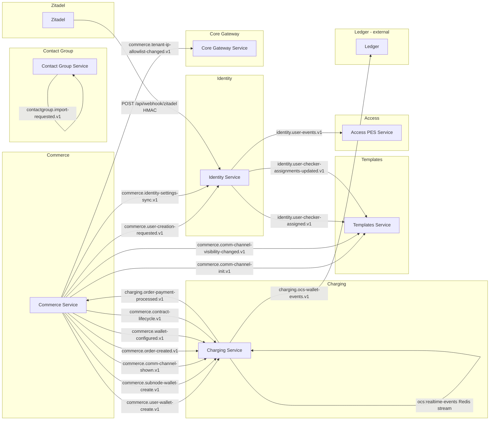

*** Event Topology Index — Kafka + Redis + Zitadel webhooks ***
*** Discovered 2026-05-15 by Brain SK Phase 3C — Kafka topology ***
*** Source mining: SERVICE_OVERVIEW + ENDPOINT_REGISTRY + DTO_DICTIONARY across all 9 backend services ***

# Event Topology — Falcon Platform

> One paragraph of orientation: Falcon's backend communicates across services via **Confluent Kafka** with an **Avro Schema Registry (BACKWARD compatibility)** as the primary asynchronous bus, plus a **Redis stream** (`ocs:realtime-events`) for the OCS hot path (WHATSAPP / SMS / VOICE), plus inbound **Zitadel webhooks** for identity-side state changes. Total surface as discovered: **17 Kafka topics + 1 Redis stream + 1 inbound webhook**. Commerce is the dominant producer (9 topics), Charging is dominant on both sides (6 consume / 2 produce), Templates is consumer-only, Provisioning has **no Kafka activity at all** (Commerce → Provisioning is direct HTTP), and System Gateway has no Kafka consumer.

## Quick links

- Per-event files in this folder — one `<topic-name>.md` per topic (slug-friendly file name; topic name preserved verbatim inside)
- Vault graph nodes — `C:\Falcon\Brain SK\_obsidian\47-Events\<Event Name>.md`
- Hubs: [BACKEND_INDEX](../../../Brain%20Outputs/understanding/backend/BACKEND_SERVICE_MAP.md) · [Integration Overview](../INTEGRATION_OVERVIEW.md) · [Gap List](../GAP_LIST.md)

## Topology — producer → consumer (master table)

| # | Topic / channel | Type | Producer | Consumer(s) | Triggering business event |
|---|---|---|---|---|---|
| 1 | `commerce.user-creation-requested.v1` | Kafka (Avro) | Commerce | Identity | Add-Client Step 5 (AO user) · Add-User wizard |
| 2 | `commerce.user-wallet-create.v1` | Kafka (Avro) | Commerce | Charging | New user provisioned — needs a sub-wallet |
| 3 | `commerce.subnode-wallet-create.v1` | Kafka (Avro) | Commerce | Charging | Add-Node — sub-node wallet creation |
| 4 | `commerce.comm-channel-shown.v1` | Kafka (Avro) | Commerce | Charging | CommChannel made visible → may need channel sub-wallet |
| 5 | `commerce.comm-channel-init.v1` | Kafka (Avro) | Commerce | Templates | New comm-channel — initialize default config row |
| 6 | `commerce.comm-channel-visibility-changed.v1` | Kafka (Avro) | Commerce | Templates | Visibility flip — Templates updates its projection |
| 7 | `commerce.order-created.v1` | Kafka (Avro) | Commerce | Charging | Service-order ("Do Payment") created — payment processing kicks off |
| 8 | `commerce.wallet-configured.v1` | Kafka (Avro) | Commerce | Charging | Account-level wallet settings configured (master/per-channel/per-owner mode, currency) |
| 9 | `commerce.contract-lifecycle.v1` | Kafka (Avro) | Commerce | Charging | Contract Activated / Expired (status scheduler) |
| 10 | `commerce.identity-settings-sync.v1` | Kafka (Avro) | Commerce | Identity | Tenant settings changed (password policy / login policy) — Identity syncs |
| 11 | `commerce.tenant-ip-allowlist-changed.v1` | Kafka (Avro) | Commerce | Core Gateway | Tenant IP allowlist updated — Core Gateway invalidates its Redis cache |
| 12 | `charging.order-payment-processed.v1` | Kafka (Avro) | Charging | Commerce | Charging finished processing the order — Commerce updates order status |
| 13 | `charging.ocs-wallet-events.v1` | Kafka (Avro) | Charging (outbox) | Ledger (external/downstream) | Any OCS wallet mutation — published via `WalletOutboxPublisherWorker` for Ledger |
| 14 | `identity.user-events.v1` | Kafka (Avro) | Identity | Access (PES) · (Charging — speculative) | User created / deleted / role changed — PES syncs role/permission links |
| 15 | `identity.user-checker-assigned.v1` | Kafka (Avro) | Identity | Templates | A user was assigned as a Checker (PRD-05 Maker/Checker) |
| 16 | `identity.user-checker-assignments-updated.v1` | Kafka (Avro) | Identity | Templates | Bulk update of Checker assignments |
| 17 | `contactgroup.import-requested.v1` | Kafka (Avro) | Contact Group | Contact Group (self-consume) | Successful upload-session submit — internal async durability pattern |
| 18 | `ocs:realtime-events` | Redis stream | Charging | Charging internal hot path (Ledger reads possible) | Real-time charge on hot channel (WHATSAPP / SMS / VOICE) |
| 19 | Zitadel webhook → `POST /api/webhook/zitadel` | HTTP webhook (HMAC) | Zitadel | Identity | UserLocked / UserUnlocked / UserDeactivated / UserReactivated / EmailVerified / PhoneVerified |
| (dev) | `commerce.test-event` | Kafka (dev) | Commerce / Charging `TestKafkaController` | Commerce / Charging (round-trip verification) | Dev-only smoke test |

## Mermaid — producer → consumer view

## Per-PRD breakdown — which events serve which PRD

| PRD | Events that materialize this PRD |
|---|---|
| **PRD-01 Account Management** | `commerce.user-creation-requested.v1` · `commerce.user-wallet-create.v1` · `commerce.subnode-wallet-create.v1` · `commerce.comm-channel-shown.v1` · `commerce.wallet-configured.v1` · `commerce.identity-settings-sync.v1` · `commerce.tenant-ip-allowlist-changed.v1` |
| **PRD-02 User Management** | `commerce.user-creation-requested.v1` · `identity.user-events.v1` · Zitadel webhook → Identity |
| **PRD-03 Contract / Packaging / Charging / Billing** | `commerce.contract-lifecycle.v1` · `commerce.order-created.v1` · `charging.order-payment-processed.v1` · `charging.ocs-wallet-events.v1` · `ocs:realtime-events` |
| **PRD-04 Contact Group Management** | `contactgroup.import-requested.v1` |
| **PRD-05 Templates (Maker/Checker)** | `commerce.comm-channel-init.v1` · `commerce.comm-channel-visibility-changed.v1` · `identity.user-checker-assigned.v1` · `identity.user-checker-assignments-updated.v1` |

## Per-service producer/consumer summary

| Service | Produces | Consumes | Consumer group |
|---|---|---|---|
| Commerce | 9 topics | `charging.order-payment-processed.v1` · `commerce.test-event` | `commerce-service` |
| Charging | `charging.order-payment-processed.v1` · `charging.ocs-wallet-events.v1` · `commerce.test-event` | 6 Commerce topics | `commerce-service` *(same as Commerce — likely misconfig, see Gaps)* |
| Identity | `identity.user-events.v1` · `identity.user-checker-assigned.v1` · `identity.user-checker-assignments-updated.v1` *(last two inferred from Templates consumer side; only `identity.user-events.v1` is enumerated in Identity SERVICE_OVERVIEW)* | `commerce.user-created.v1` *(drift — see Gaps)* · `commerce.identity-settings-sync.v1` | `falcon-identity-svc` |
| Templates | none | `commerce.comm-channel-init.v1` · `commerce.comm-channel-visibility-changed.v1` · `identity.user-checker-assigned.v1` · `identity.user-checker-assignments-updated.v1` | `templates-service` |
| Contact Group | `contactgroup.import-requested.v1` | (same topic, self-consume) | `contactgroup-service` |
| Access (PES) | none | `identity.user-events.v1` | `falcon-pes-svc` |
| Core Gateway | none | `commerce.tenant-ip-allowlist-changed.v1` | `core-gateway-service` |
| System Gateway | none | none | n/a |
| Provisioning | none | none | n/a *(Commerce → Provisioning is direct HTTP — no Kafka)* |

## Schema / contract conventions

- **Encoding:** Avro via Confluent Schema Registry. Compatibility: `BACKWARD`.
- **Security:** `Plaintext` security protocol observed on Identity and Access (PES) — verify against production.
- **Outbox pattern:** Used by **Charging** (`WalletOutboxPublisherWorker` + `OcsOutbox` config) and **Commerce** (`UnitOfWorkFilter` global filter wraps Mongo + Kafka outbox flush per controller action).
- **Idempotency:** Asserted at consumer side only in **Charging** (Redis cache, `IdempotencyTtlSeconds: 86400` = 24h) for HTTP mutators. **No documented Kafka-consumer idempotency** anywhere else (Templates, Identity, Core Gateway, Access, Contact Group consumers all silent on dedup). This is a platform-wide gap.

## Known gaps surfaced by this scan

| # | Gap | Severity | Detail |
|---|---|---|---|
| KAFKA-GAP-01 | **Topic-name drift on user-creation event** | HIGH | Commerce publishes `commerce.user-creation-requested.v1` (per Commerce SERVICE_OVERVIEW + NodeController FRONTEND_CONTRACT). Identity's SERVICE_OVERVIEW lists the consumer as listening to `commerce.user-created.v1`. Consumer class name (`UserCreationRequestedConsumer`) matches the producer — so this is **documentation drift**, not code drift, but it MUST be reconciled by reading the Identity Kafka consumer registration code before any new event is added. |
| KAFKA-GAP-02 | **Shared consumer group between Commerce and Charging** | HIGH | Both services use `commerce-service` as their consumer group id (per their SERVICE_OVERVIEW). This means Charging and Commerce can race on the same partition — only one will receive any given event, and which one is non-deterministic. Almost certainly a misconfig in Charging — should be `charging-service` or similar. |
| KAFKA-GAP-03 | **No DLQ / dead-letter routing documented anywhere** | HIGH | None of the 9 services document a dead-letter topic, poison-pill handler, or retry policy for Kafka consumers. Behaviour on Avro deserialization failure / handler exception is undocumented — likely to block-the-partition by default. |
| KAFKA-GAP-04 | **Templates / Identity consumer idempotency not documented** | MEDIUM | Templates consumes 4 topics and Identity consumes 2, but neither documents an idempotency key, de-duplication table, or "already-applied" check. Replays / re-deliveries could double-write projections. |
| KAFKA-GAP-05 | **Identity-side producers not fully enumerated** | MEDIUM | Identity SERVICE_OVERVIEW lists only `identity.user-events.v1` as a produced topic, but Templates SERVICE_OVERVIEW consumes two additional Identity topics (`identity.user-checker-assigned.v1`, `identity.user-checker-assignments-updated.v1`). These must exist (Templates can't consume what doesn't exist) but the Identity-side publisher class and trigger are not documented. |
| KAFKA-GAP-06 | **`commerce.test-event` left in production config** | LOW | Both Commerce and Charging register publisher + consumer for this dev topic. Either gate behind environment flag or move to test-only fixtures before production. |
| KAFKA-GAP-07 | **Avro schemas not surfaced in DTO_DICTIONARY** | MEDIUM | The Avro event classes (`UserRoleLinkSyncRequestedAvroEvent` is the only one named) are mostly invisible from DTO_DICTIONARY scans. Avro contracts live in `.avsc` files in code — would need a source-code scan to materialize payload shape per event. Marked `inferred` / `not documented in Brain Outputs` per event note. |
| KAFKA-GAP-08 | **`charging.ocs-wallet-events.v1` consumer is "Ledger" — but no Ledger service is in this scan** | MEDIUM | The Ledger consumer is referenced as a downstream — but no `falcon-core-ledger-svc` exists in the 9-service inventory. Either Ledger is external, deferred, or a planned service. Unblocked questions: who consumes wallet mutations today? |
| KAFKA-GAP-09 | **Provisioning is Kafka-deaf** | LOW (architectural choice) | Per the Wiki rule *"internal services NEVER call each other through gateways — use gRPC/Kafka directly"*, the Commerce → Provisioning HTTP coupling is a deliberate choice for the Add-Client wizard's synchronous Step-3 service-creation, but it's worth recording because every other east-west call is Kafka. |
| KAFKA-GAP-10 | **`contactgroup.import-requested.v1` downstream is unknown** | LOW | Contact-Group both produces and self-consumes this topic for async durability, but there's no documented external consumer (no campaign tooling service in scope yet). Producer-only on the external side. |

## Honesty notes

- Per-event payload shapes are mostly **inferred from consumer/publisher class names and Commerce orchestration flows** — the canonical Avro `.avsc` files live in source code and were not deeply scanned for this pass.
- Triggers are inferred from PRD context, Add-Client multi-step flow documentation, and event names. Where the actual orchestrator call-site is undocumented, the per-event file flags it.
- This is event topology **as understood from Brain Outputs as of 2026-05-15**. Code drift between Brain Outputs and the actual service repos has not been re-verified.

## Hubs

- [[BACKEND_INDEX]] · [[PRD_INDEX]] · [[VALIDATION_INDEX]] · [[API_INDEX]] · [[GAPS_INDEX]] · [[AMMAR_BRAIN_HOME]]
