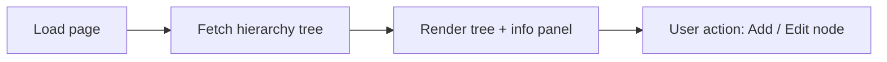

# Organization Hierarchy — Implementation Status (SAMPLE)

> **SAMPLE REPORT** — illustrative values only, generated to demonstrate the mandatory
> Chart Provenance & Generation Trace requirement. This is **not** a real statistics run;
> every number is a placeholder marked `SAMPLE`.
> Built from `skills/executive-insight-reports/templates/EXECUTIVE_REPORT.template.md`.

- **Report category:** executive report
- **Generated:** 2026-05-19 14:30 (SAMPLE)
- **Triggering skill:** Executive Insight Reports
- **Numbers calculated by:** Statistical Intelligence (see `FORMULAS_USED.md`)

---

## 1. Executive Summary

The Organization Hierarchy page sits at an illustrative **82% implementation readiness**
(SAMPLE). UI/UX and Validation are strong; API integration carries the remaining risk.
All numbers in this report are sample values for template demonstration only.

## 2. KPI Scorecard

| KPI | Value | Status | Source |
|---|---|---|---|
| Page Implementation Readiness | 82% (SAMPLE) | GOOD | understanding/pages/organization-hierarchy/PAGE_SCORECARD.md |
| UI/UX | 90% (SAMPLE) | STRONG | PAGE_SCORECARD.md |
| Validation | 85% (SAMPLE) | GOOD | PAGE_SCORECARD.md |
| API | 70% (SAMPLE) | PARTIAL | API_RULES.md |

## 3. Charts

### Chart 1 — Page Implementation Readiness Scorecard

`[ECharts bar chart — dimension scores UI/UX, Business, Validation, API, Test coverage. SAMPLE]`

**Chart Provenance**
- chart title: Page Implementation Readiness Scorecard
- chart purpose: Show each implementation dimension's score against the 0–100 scale
- skill used: Executive Insight Reports + Statistical Intelligence
- tool / library used: ECharts (bar chart)
- data source file(s): Brain Outputs/understanding/pages/organization-hierarchy/PAGE_SCORECARD.md; .../API_RULES.md
- metric / formula used: Page Implementation Readiness % = (UIUX*0.25)+(Business*0.20)+(Validation*0.20)+(API*0.20)+(TestCoverage*0.15)
- aggregation method: weighted average
- generated output path: charts/page-readiness-scorecard.json — rendered in this section
- why this chart type was selected: a bar chart compares independent dimension scores on one axis at a glance for a non-technical reader
- report category: executive report

## 4. Diagrams

### Diagram 1 — Organization Hierarchy Page Flow

**Chart Provenance**
- chart title: Organization Hierarchy Page Flow
- chart purpose: Show the page load and primary-action flow for the boss
- skill used: Executive Insight Reports
- tool / library used: Mermaid (flowchart)
- data source file(s): Brain Outputs/understanding/pages/organization-hierarchy/PAGE_LEARNING.md
- metric / formula used: none (structural diagram, not a metric)
- aggregation method: none
- generated output path: diagrams/org-hierarchy-flow.mmd — rendered in this section
- why this chart type was selected: a left-to-right flowchart is the clearest way to show a linear page flow
- report category: executive report

## 5. Evidence

- Brain Outputs/understanding/pages/organization-hierarchy/PAGE_SCORECARD.md (SAMPLE source)

## 6. Risks / Gaps

| Risk / Gap | Severity | Notes |
|---|---|---|
| API integration at 70% (SAMPLE) | Medium | 2 endpoints unmapped — illustrative |

## 7. Next Actions

1. Close the 2 unmapped API endpoints (SAMPLE action).

## 8. Chart Provenance Table (MANDATORY)

| Chart | Skill Used | Library | Data Source | Formula / Metric | Why This Chart |
|---|---|---|---|---|---|
| Page Implementation Readiness Scorecard | Executive Insight Reports + Statistical Intelligence | ECharts | PAGE_SCORECARD.md, API_RULES.md | Page Implementation Readiness % (weighted) | Bar chart compares dimension scores at a glance |
| Organization Hierarchy Page Flow | Executive Insight Reports | Mermaid | PAGE_LEARNING.md | none (structural) | Flowchart shows the linear page flow clearly |

## Provenance & trace files

- [CHART_PROVENANCE.md](./CHART_PROVENANCE.md) — full per-chart provenance
- [REPORT_GENERATION_TRACE.md](./REPORT_GENERATION_TRACE.md) — how this report was generated
